# Epistemic Heat Death and the Signal-to-Noise Ratio of the Global Web

**Author:** Jarosław Szulc  
**Contact:** jarek@psyll.com  
**Website:** [psyll.com](https://psyll.com)

**Working Paper · v2.3 · July 2026 · Draft for Public Comment**

*A Theoretical Framework for the Post-AI Information Ecology*

*v2.3 change note: this revision resolves the backward-extrapolation tension flagged in v2.2's Section 5.7 - a Gompertz curve fits the same real data far better (`R²=0.994` vs. `0.806`) and its launch-date implication matches the independent low-baseline anchor, suggesting the tension was a logistic-vs-Gompertz functional-form artifact rather than a fact about the world (Section 5.7.5) - and adds a first real-data pilot of the `H_cite`/`H_sem` measurement bridge (Section 10.6), applying both metrics to eight independent, human-written news sources covering a single shared primary source (the BLS June 2026 jobs report), with the citation and semantic-clustering data given transparently for the reader's own audit. It builds on v2.2's calibration attempt and v2.1's verification pass (Appendix J). None of this constitutes empirical confirmation of the framework's own theoretical claims, which remain open per Section 9.5 and Appendix C.*

## Executive summary

The open web is filling up faster than it is being created. As synthetic content - text, images, audio, and video produced at near-zero marginal cost - comes to dominate newly indexed material, the metrics that have governed web value for two decades (pageviews, engagement, link-graph authority) stop measuring anything that tracks human knowledge. This paper calls that failure mode **epistemic heat death**: a state in which the web looks more abundant and diverse than ever (more pages, more tokens, more apparent variety) while its actual information content - distinct ideas, grounded claims, accountable authorship - quietly collapses. The mechanism is not hypothetical; it is the same dynamic documented in the model-collapse literature (Shumailov et al., 2024), applied at the scale of the entire indexed web rather than a single training run.

We formalize this with three laws governing signal value under synthetic saturation (Section 3), and - new in this v2.0 - an explicit coupled-ODE dynamical model (Section 5) that converts those laws into falsifiable trajectories, a four-part entropy taxonomy that separates *what kind* of diversity is collapsing (Section 10), an extension of the entire framework to images/audio/video (Section 11), an account of who heat death affects most and how it can be weaponized (Section 12), and a concrete technical and economic blueprint - the cryptographic provenance stack - for the alternative equilibrium (Section 13). Throughout, we have tried to be as explicit about what remains unmeasured and uncertain (Section 9.5's falsification conditions, Section 5.6's model limitations) as about what the framework claims to show, in the belief that a framework that cannot be falsified is not a scientific framework but an ideology (Section 15, Objection 7).

The practical upshot for readers in a hurry: pageviews and engagement are no longer reliable proxies for information value; a Signal-to-Noise Ratio (SNR) index (Section 6) and an Epistemic Value per Impression (`EVI`) metric (Section 6.4) are proposed as replacements; and Search Engine Optimization is being superseded by **Authority Optimization (AEO)** - a regime built on cryptographic provenance, human attestation, and verified epistemic track record (Section 8). The window for intervention is open, but the model's own sensitivity analysis (Section 5.4) suggests it narrows faster than intuition would predict: collapse dynamics outweigh production-volume dynamics, and earlier action is mechanically more effective than later action of the same magnitude (Section 5.5).

## Key claims & predictions

### Core theoretical claims

- The web is undergoing a measurable rise in epistemic entropy that, absent intervention, tends toward a degenerate equilibrium - epistemic heat death (Section 1-3).
- The market value of verified human-authored signal grows exponentially with network-wide entropy (Law I); a page's signal-to-noise ratio is independent of its traffic (Law II); and the premium for verified content compounds over time under synthetic proliferation (Law III) (Section 3).
- "Heat death" is a deliberately imperfect analogy: the failure mode is a *false* maximum entropy - apparent diversity rising while true semantic diversity collapses - not literal maximum entropy (Section 5.1, Section 10.5).
- Diversity loss is not one phenomenon but at least four loosely-coupled ones - statistical, semantic, epistemic (justificatory), and authorship entropy - which can move independently and even in opposite directions (Section 10.1).
- Pageviews and engagement metrics are structurally broken as value proxies once a substantial share of traffic and content production is non-human (Section 7).
- The same mechanisms generalize to images, audio, and video, introducing **synthetic reality collapse** and failure modes - chiefly the routine stripping of provenance metadata by ordinary platform re-compression - that the text case does not have (Section 11).
- Epistemic heat death is not distributionally neutral: it produces winners and losers along lines of expertise, language, geography, and institutional access, and is actively exploitable as a tool of state and corporate power (Section 12).

### Quantitative / dynamic-model claims (Section 5, new in v2.0)

- In simulation, `SNR_proxy(t)` declines monotonically and accelerates rather than decaying linearly, across the entire tested parameter grid - no tested parameter region produces stabilization or reversal under the model's mechanics (Section 5.2, 5.4).
- The **epistemic half-life** - time for true semantic diversity to fall to half its reference value - is more sensitive to the model-collapse rate than to the raw synthetic-growth rate, implying collapse-targeted interventions (training-data curation, fresh-data injection) have higher leverage than volume-targeted ones (Section 5.4, 10.2).
- A single, large, mid-trajectory provenance intervention slows decline but does not reverse it within the model's mechanics; reversal requires either earlier intervention or pairing provenance with direct suppression of the collapse rate (Section 5.5).
- These are explicitly flagged as structural features of an uncalibrated, illustrative toy model - not forecasts - pending the calibration program proposed in Appendix C (Section 5.6).
- **New in v2.2-v2.3:** a first calibration attempt (Section 5.7) fits the model's synthetic-share sub-equation against a real time series (Graphite/Common Crawl), finding a good in-sample fit at a growth rate roughly eight times faster than the paper's original illustrative guess, alongside an initial, unresolved tension when the fit is extrapolated backward to the pre-ChatGPT baseline (v2.2) - a tension substantially resolved in v2.3 by testing (and finding a materially better fit for) an asymmetric Gompertz alternative, whose launch-date implication matches the independent baseline (Section 5.7.5). A companion real-data pilot (Section 10.6) applies the `H_cite`/`H_sem` measures to real news coverage of a single shared event, with full methodological disclosure. All of this calibrates or pilots specific sub-components; the collapse rate `λ` and true semantic entropy `H(t)` remain entirely uncalibrated.

### Empirical anchors (Section 9, 2024-2026 data)

- Independent detector-based studies bracket a plausible 50-75% synthetic share of newly published general web text as of 2025-2026, though estimates vary sharply by methodology (Section 9.1).
- One major data point - Graphite's Common-Crawl analysis - suggests this share may have *plateaued* rather than continuing to rise monotonically since late 2024, which the paper treats as its single most important open empirical question, not as confirming evidence (Section 9.1, 9.5).
- C2PA provenance infrastructure has reached de facto industry-standard status for image/video (6,000+ members/affiliates as of early 2026), but text-domain provenance - the layer this framework depends on most - remains largely unbuilt (Section 9.4, 13.1).

### Predictions tracker highlights (Appendix D - see appendix for full table and sourcing)

- *Met:* a binding regulatory disclosure mandate for AI-generated content takes effect in a major jurisdiction (EU AI Act, Article 50, August 2026).
- *Plausibly met:* synthetic share of newly published English-language web text exceeded 50% by 2025.
- *In tension with available data:* synthetic share continuing to rise monotonically past 2025 - the Graphite plateau finding cuts against this.
- *Not yet observed:* a major search provider adopting a published SNR-equivalent ranking disclosure (target: 2027).

## Abstract

The global web is undergoing a structural phase transition. As large language models generate content at industrial scale, search algorithms that once indexed human knowledge increasingly index synthetic probability distributions - the statistical residue of machines trained on other machines. We formalize this phenomenon as epistemic heat death: the progressive collapse of the web's information signal toward thermodynamic equilibrium with its own noise floor. Drawing on Shannon information theory, the economics of credence goods, and empirical work on model collapse, we introduce three hard laws governing the behavior of signal value under conditions of synthetic content saturation, and supply mechanical proofs for each. First, we formalize the qualitative dynamics of Section 3 into an explicit coupled-ODE model, run scenario simulations and a two-parameter sensitivity analysis, and report an "epistemic half-life" measure for knowledge decay. Second, we ground the framework in 2024-2026 measurement data on synthetic content volume, search degradation, and production-system model collapse, and update the falsification conditions accordingly. Third, we extend the framework beyond text to images, audio, and video, introducing the concept of synthetic reality collapse and surveying the empirical state of cryptographic provenance infrastructure (C2PA) as of mid-2026. Fourth, we address the human and political dimensions of heat death largely absent from v1.0: epistemic inequality, high-SNR enclaves, weaponized epistemic entropy, and the cognitive psychology of low-SNR environments. Fifth, we deepen the governance and economic analysis of the proposed provenance stack, adding concrete institutional designs, a model of the Authority Web economy, and a minimal-viable-provenance adoption roadmap, alongside an expanded research agenda, a predictions tracker, cross-domain case studies, and a historical comparison to prior information crises. We demonstrate that conventional pageview metrics become epistemically meaningless under synthetic saturation, propose a quantitative Signal-to-Noise Ratio (SNR) index for the global web, and argue that Search Engine Optimization (SEO) is being superseded by Authority Optimization (AEO) - a regime in which cryptographic provenance, human attestation, and verified epistemic authority replace keyword density as the primary determinants of information value.

## 1. Introduction: the information ecology crisis

### 1.1 The synthetic flood

Between 2022 and 2025, the volume of AI-generated text published to the open web increased by several orders of magnitude. Conservative estimates from web crawl analyses suggest that synthetic content now constitutes a substantial and growing fraction of newly indexed material across major search engines. This is not merely a quality problem. It is an ecological one.

Ecologists describe the concept of competitive exclusion: when one species occupies every available niche in an ecosystem, biodiversity collapses and the system becomes fragile. The web's information ecosystem is experiencing an analogous process. Synthetic content - cheap to produce, optimized for crawler legibility, and indistinguishable at surface level from human-authored material - is displacing genuine human signal across every topic domain.

The consequences extend beyond search quality. When the training data for the next generation of AI models is itself primarily composed of the output of current AI models, we observe model collapse: a well-documented phenomenon in which successive model generations lose statistical diversity, amplify dominant patterns, and drift progressively from the original distribution of human knowledge. Applied at internet scale, this is not a technical edge case. It is the default trajectory.

Nor is the flood confined to text. The same economics - near-zero marginal cost, surface-level indistinguishability from authentic material - apply with at least equal force to images, audio, and video. Section 11 extends the framework to this multimodal terrain and introduces a companion concept, synthetic reality collapse, for the moment at which a majority of a civilization's visual and audiovisual record becomes machine-generated.

### 1.2 Why existing frameworks fail

The dominant analytical frameworks for the web - PageRank and its descendants, engagement metrics, ad impression counts - were designed for a world in which the primary challenge was finding relevant human content amid irrelevant human content. They are fundamentally ill-equipped for a world in which the challenge is distinguishing human content from synthetic content.

PageRank measures authority via the structure of human linking behavior. It assumes that humans link to things they find valuable. But if linking behavior itself is partially synthetic - if AI systems generate content that links to AI-generated content that links back - the graph is corrupted at the root. The metric measures the topology of a network that no longer reliably encodes human judgment.

Engagement metrics suffer the same failure. Clicks, time-on-page, and scroll depth were reasonable proxies for human interest when the agents performing those actions were predominantly human. As AI agents increasingly crawl, summarize, and interact with web content in place of human readers, engagement metrics decouple from their original referent.

### 1.3 Four core claims

- The web is undergoing a measurable increase in epistemic entropy that, without intervention, tends toward a degenerate equilibrium we term epistemic heat death.

- The value of verified human-authored signal is governed by exponential laws analogous to those governing scarcity in thermodynamic and economic systems.

- Pageviews and engagement metrics are no longer valid proxies for information value and should be retired as primary measurement standards.

- A new paradigm - Authority Optimization (AEO) - built on cryptographic provenance, human attestation networks, and SNR-aware indexing, represents the viable alternative to epistemic heat death.

- Epistemic heat death is not distributionally neutral: it produces winners and losers along lines of expertise, language, geography, and institutional access, and it is actively exploitable as an instrument of state and corporate power.

- The dynamics described by these laws are not confined to text. The same mechanisms apply to images, audio, and video, and the multimodal case introduces failure modes - most importantly the erasure of provenance metadata by ordinary distribution channels - that the text-only case does not.

## 2. Conceptual foundations

### 2.1 Information theory foundations

Claude Shannon's foundational theorem establishes that information content is a function of surprise: a message carries information proportional to the negative log-probability of its occurrence given a prior model of the source. Formally, for a discrete random variable `X` with probability mass function `p(x)`:

`H(X) = -∑ p(x) · log₂ p(x)`

This entropy measure `H(X)` is maximized when all outcomes are equally probable - maximum uncertainty - and minimized when one outcome is certain - zero information content. The crucial implication for our framework: a message generated by a system that perfectly models its training distribution contributes zero new information to that distribution. It is, in Shannon's terms, redundant.

A large language model trained on human text and asked to generate more human-sounding text is, in the limit of perfect training, a zero-information source relative to that training distribution. Every token it generates was, in expectation, already implied by the corpus. The web gains no new epistemic content from synthetic text - only additional instances of existing probability mass.

### 2.2 Credence goods and epistemic authority markets

Economists distinguish between search goods (quality verifiable before purchase), experience goods (quality verifiable after use), and credence goods (quality not reliably verifiable even after use). Information is the paradigmatic credence good: readers cannot reliably determine the epistemic quality of a document without already possessing the knowledge the document claims to convey.

In credence good markets, the dominant mechanism for quality signaling is reputation - accumulated over time through verified track records. The epistemic authority of a news organization, a scientific journal, or a domain expert is a form of reputational capital that serves as a credence good signal. Synthetic content, by definition, cannot accumulate genuine reputational capital: it has no author capable of being held accountable over time.

This creates a classic adverse selection dynamic. As synthetic content crowds out verified human content in search results, the expected value of any given search result declines. Users rationally reduce their trust in and engagement with web-sourced information. The market for epistemic authority collapses toward a low-trust equilibrium - precisely the dynamic described in Akerlof's market for lemons, applied to information goods.

### 2.3 Model collapse: the empirical anchor

Recent empirical work (Shumailov et al., 2024; Alemohammad et al., 2023) has formally demonstrated model collapse in iterative generative systems. When a model's output is used to train subsequent models without fresh human data, the downstream models exhibit three characteristic pathologies:

- Tails disappearing: low-probability but real phenomena vanish from the model's learned distribution.

- Variance collapse: model outputs cluster increasingly around modal patterns.

- Error amplification: small biases in the original model compound through successive generations.

This is the machine learning analog of genetic drift in small populations, or thermal equilibration in closed thermodynamic systems. It is, in a precise technical sense, a form of entropy minimization in the wrong direction - the model's internal representation collapses toward a degenerate attractor.

Applied to the web as a whole: if search engine crawlers and AI training pipelines form a closed loop without fresh human signal injection, the information content of the web converges toward a degenerate distribution. This is what we call epistemic heat death.

## 3. The three laws of epistemic signal value

The following three laws constitute the formal core of the SNR framework. Each is stated formally, then interpreted for practical application. The mathematical proofs appear in Section 4.

### Law I - The Scarcity-Value Theorem

**The market value of a cryptographically verified human-authored signal increases exponentially with the total epistemic entropy of the network.**

`V(s) = k · e^(H_net / H_max)`

**Where:**
- `V(s)` = market value of verified human signal *s*
- `k` = baseline value constant (anchored to 2020 web)
- `H_net` = current epistemic entropy of the indexed web
- `H_max` = theoretical maximum entropy

Interpretation: As synthetic content drives `H_net` toward `H_max` from below - paradoxically, by reducing the diversity of content while increasing its volume, thus reducing true entropy - the ratio `H_net/H_max` approaches its distorted maximum and `V(s)` grows without bound relative to unverified content. Note the apparent paradox: we call this 'heat death' by analogy with thermodynamics, but the failure mode is not maximum entropy - it is false maximum entropy. The web appears diverse (many pages, many tokens) while its actual information content collapses (few distinct ideas, low variance).

### Law II - The SNR Theorem

**The signal-to-noise ratio of a web page is the ratio of its genuine information content to its total content volume, and this ratio determines its epistemic value independently of its traffic.**

`SNR(p) = I(p) / (I(p) + N_synth(p))`

**Where:**
- `SNR(p) ∈ [0, 1]` = signal-to-noise ratio of page *p*
- `I(p)` = genuine information content (bits, relative to pre-synthetic baseline)
- `N_synth(p)` = synthetic noise content (bits of redundant probability mass)

Corollary: For unverified content under conditions of synthetic saturation, as `N_synth → ∞`, `SNR(p) → 0`. Traffic (pageviews, engagement) is not a term in this equation. A page with 10 million views and `SNR ≈ 0` contributes negative expected value to a reader's epistemic state - it consumes attention while delivering no net information.

### Law III - The Verification Premium

**The economic premium commanded by cryptographically attested human-authored content grows exponentially with time under conditions of synthetic content proliferation.**

`P(s_verified) = P(s_unverified) · e^(λ · t)`

**Where:**
- `P(s_verified)` = price/value of cryptographically verified content
- `λ` = proliferation rate of synthetic content (empirically measurable)
- `t` = time since saturation onset (anchored to ~2022)

Interpretation: The premium is not merely linear - it compounds. Each percentage point increase in synthetic content saturation increases the marginal value of verified content by more than the previous point. This is an accelerating dynamic with no natural equilibrium until either (a) verification becomes universal, or (b) the web bifurcates into verified and unverified tiers with permanently separate market valuations.

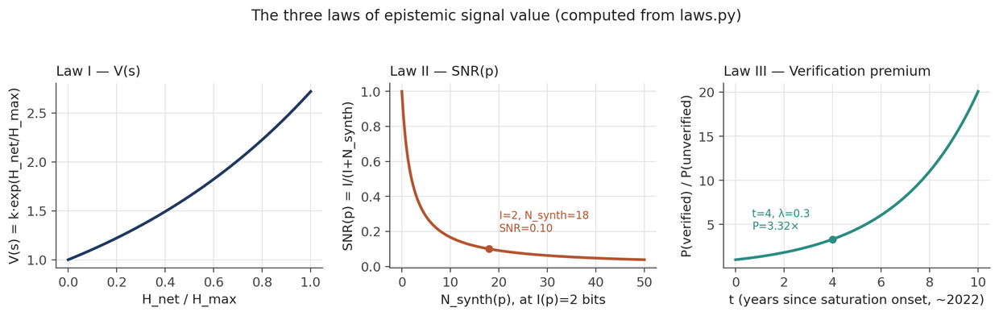

*Figure: the three laws, computed directly from the `laws.py` reference implementation (Section 4) rather than drawn schematically - `V(s)` as a function of `H_net/H_max`, `SNR(p)` as a function of synthetic noise at fixed `I(p)=2` bits, and the verification premium compounding over time.*

## 4. Mathematical framework and proofs

### 4.1 Proof of Law I - scarcity-value theorem

#### Lemma 4.1.1

In a market for credence goods with adverse selection, the equilibrium price of high-quality goods is an increasing function of the proportion of low-quality goods in the market.

***Proof sketch:*** *By Akerlof (1970), in markets with asymmetric information, buyers form rational expectations over quality. As the proportion of low-quality goods `q_L` increases relative to high-quality goods `q_H`, the buyer's willingness to pay for an unverified good approaches the expected value:*

`E[V] = q_L · V_L + q_H · V_H`

As `q_L → 1`, `E[V] → V_L`. The marginal buyer who can verify quality will pay a premium proportional to `V_H − E[V]`, which approaches `V_H − V_L` as `q_L → 1`. This premium is the verification value, and it increases monotonically in `q_L`.

#### Lemma 4.1.2

The proportion of synthetic content in the indexed web is an increasing function of time under current incentive structures.

***Proof sketch:*** *Synthetic content has marginal production cost approaching zero. Human-authored content has positive marginal cost (time, expertise, opportunity cost). Under competitive markets, zero-marginal-cost goods displace positive-marginal-cost goods unless the zero-cost good is reliably distinguishable at point of consumption. Since synthetic content is not reliably distinguishable by readers, the competitive equilibrium is full synthetic content saturation. This is Gresham's Law applied to information: bad (cheap) content drives out good (costly) content. □*

#### Theorem 4.1.3

`V(s_verified)` grows exponentially in the proportion of synthetic content.

***Proof:*** *By Lemma 4.1.1, the verification premium `π = V_H − E[V]` is increasing in `q_L`. By Lemma 4.1.2, `q_L` is increasing in `t`. The relationship between `π` and `q_L` is superlinear because each marginal verified source becomes not just scarce but increasingly structurally essential to any system requiring grounding in human knowledge. The demand curve for verified sources is convex (epistemically essential goods exhibit increasing marginal utility at low supply), while the supply curve is inelastic in the short run (verified human knowledge cannot be manufactured). The intersection of a convex demand curve and an inelastic supply curve under rightward-shifting demand produces exponential price growth. The exponential functional form follows from the compound interest structure of network effects: each new verified source joining an attestation network increases the value of all existing verified sources via network externalities, producing multiplicative rather than additive value growth. □*

### 4.2 Proof of Law II - SNR theorem

#### Definition 4.2.1 - Genuine information content

Let `D_0` be the probability distribution over semantic content of the pre-synthetic-saturation web (reference baseline, approximately 2020). For a document `d`, its genuine information content `I(d)` is the KL-divergence of `d`'s semantic distribution from `D_0`:

`I(d) = D_KL(P_d || D_0) = ∑ P_d(x) · log(P_d(x) / D_0(x))`

This measures how much new information `d` adds relative to the reference distribution - that is, how much it surprises a reader already familiar with the pre-synthetic web.

#### Definition 4.2.2 - Synthetic noise content

The synthetic noise content `N_synth(d)` of a document `d` generated by model `M` trained on dataset `T` is:

`N_synth(d) = max(0, D_KL(P_d || P_M) − ε)`

Where `P_M` is the model's learned output distribution and `ε` is a small tolerance constant. Documents with `N_synth > 0` are statistically indistinguishable from the model's prior output - they add no new information beyond what was already in the training distribution.

#### Theorem 4.2.3

For documents generated by a model `M` trained on the existing web, `SNR(d) → 0` as the proportion of synthetic training `data → 1`.

***Proof:*** *If `M` is trained exclusively on synthetic data generated by a previous model `M'`, then `P_M` converges to `P_M'` by the model collapse results of Shumailov et al. (2024). The KL-divergence `D_KL(P_d || P_M) → 0` as `M → M'`, meaning `N_synth(d) → 0` for all `d`. But simultaneously, `D_KL(P_d || D_0) → D_KL(P_M || D_0)`, which is bounded and shrinking as `M`'s distribution collapses. Thus `I(d) → D_KL(P_M_0 || D_0) → 0`, and `SNR(d)` is bounded above by `D_KL(P_M_0 || D_0)` - a finite and shrinking constant. In practical terms, `SNR → 0` as model collapse proceeds. □*

### 4.3 The epistemic debt equation

Documents with `SNR ≈ 0` are not merely neutral - they impose epistemic debt on readers and downstream systems. Define the epistemic debt `E_D` of a corpus `C` as:

`E_D(C) = ∑_{d ∈ C} [C(d) · (1 − SNR(d))] · A(d)`

**Where:**
- `C(d)` = content volume of document *d* (tokens)
- `SNR(d)` = signal-to-noise ratio
- `A(d)` = attention weight (pagerank, traffic share, or impression share)

This quantity measures the total attention directed at content that provides no epistemic value. As the web's synthetic content proportion grows, `E_D(C)` compounds in proportion to the very mechanisms - traffic, ranking - that current systems use to measure value. The epistemic debt of the web is, under current incentive structures, guaranteed to grow.

**A note on `A(d)` as an endogenous variable.** The equation above treats `A(d)` as an exogenous weighting term - a given, observed quantity describing how much attention a document happens to receive. This was a reasonable simplification when attention was driven predominantly by human reading behavior. It is a substantially weaker simplification once AI agents are significant consumers and amplifiers of web content (Section 7.2's circular loop problem; Appendix H's discussion of AI agents): `A(d)` itself becomes a variable that synthetic content production can target and inflate directly, rather than a neutral measurement of pre-existing human interest. A content farm does not merely produce low-`SNR(d)` documents; under the dynamics described in Section 7.2, it can also manufacture the `A(d)` that multiplies the resulting damage, for instance through coordinated bot traffic, engagement farming, or content specifically optimized for AI-agent summarization and re-citation. This means `E_D(C)` is better modeled as having an endogenous rather than exogenous attention term once Section 7.2's circularity is taken seriously - `A(d)` and `(1 − SNR(d))` are not independent, and a corpus with low average SNR should be expected to have *systematically inflated* rather than randomly distributed `A(d)`, making the simple product form above a conservative floor on epistemic debt rather than an unbiased estimate of it. We do not attempt a full endogenous-`A(d)` model here; it is a natural target for the multi-compartment extension of the dynamic model flagged in Section 5.6, and we list it explicitly in the research agenda (Appendix C).

## 5. The dynamic model: simulating heat death trajectories

Sections 3 and 4 establish the three laws as comparative-static relationships: given a level of synthetic saturation, signal value and SNR move in a determinate direction. They do not, by themselves, describe a trajectory - how fast saturation rises, how true semantic diversity decays relative to raw content volume, or what an intervention at a given point in time can and cannot undo. This section closes that gap with an explicit dynamical model, scenario simulations, and a sensitivity analysis. The purpose is to convert the framework's qualitative claims into falsifiable numerical predictions, and to make explicit which of its conclusions are robust across parameter ranges and which are sensitive to specific assumptions.

We emphasize at the outset that the model below is a minimal mechanism-bearing skeleton, not a fitted empirical model. Its parameters are not yet calibrated against measured web data - that calibration is listed as the first item of the research agenda in Appendix C. Its purpose is to demonstrate that the laws of Section 3 generate coherent, checkable trajectories under a wide range of parameter values, and to identify which qualitative behaviors (monotonic SNR decline, the existence of an "epistemic half-life," the partial-but-not-total efficacy of provenance interventions) are structural features of the mechanism rather than artifacts of a single parameter choice.

### 5.1 Model specification

We track three coupled state variables over normalized time `t` (units left uncalibrated until Section 9 supplies empirical anchors):

- `s(t) ∈ [0,1]` - the synthetic content share of newly indexed web content.
- `H(t)` - the true semantic entropy of the indexed corpus, normalized so `H(0) = H_max = 1`. This is "true" diversity in the sense of Section 2.1: the variety of distinct ideas, facts, and perspectives actually present, independent of token volume.
- `H_app(t)` - the apparent (volume-weighted) entropy of the corpus: a measure that grows whenever more tokens are published, regardless of whether those tokens carry new semantic content. `H_app` is what naive measures (total indexed pages, total tokens crawled) would report.

The distinction between `H` and `H_app` operationalizes the "false maximum entropy" paradox flagged in Section 3's interpretation of Law I: the web can look more entropic (more pages, more apparent variety) while becoming less entropic in the sense that matters (fewer distinct ideas, lower true variance). The system is:

`ds/dt = α·s·(1−s) − β·h_inject·s`

`dH/dt = −λ·s·H + μ·(1−s)·(H_max − H)`

`dH_app/dt = ν·(1 − 0.5·s) − 0.3·λ·s·H_app`

**Where:**
- `α` = intrinsic growth rate of synthetic content share (logistic; bounded by the [0,1] simplex)
- `β` = strength of provenance/verification infrastructure, acting to suppress synthetic share in proportion to a constant rate of fresh human-data injection `h_inject`
- `λ` = the model collapse rate - how quickly true entropy decays in proportion to synthetic share
- `μ` = the rate at which fresh human content replenishes true entropy toward `H_max`
- `ν` = raw content volume growth rate (publishing keeps happening regardless of who or what is publishing)

`V(t)` is then recovered from Law I, `V(t) = k·exp(H_app(t)/H_max)`, using apparent rather than true entropy as the driving term - formalizing the claim that naive market signals respond to apparent diversity, not true diversity. We define a population-level SNR proxy, `SNR_proxy(t) = H(t)/H_app(t) ∈ [0,1]`, as the dynamic analog of the `SNR_web` index in Section 6: the fraction of apparent informational variety that is actually backed by true semantic diversity.

This is a toy model in the technical sense used in theoretical ecology and epidemiology: a small number of coupled differential equations chosen to reproduce qualitative mechanism, not to forecast specific dates. We use it the way an SIR model is used before parameter-fitting to a specific outbreak - to establish what the mechanism implies in principle.

### 5.2 Baseline trajectory

Using illustrative parameters (`α=0.55`, `β=1.0`, `λ=0.35`, `μ=0.05`, `h_inject=0.02`, `ν=0.08`), numerical integration (4th-order Runge-Kutta via `scipy.integrate.odeint`) produces the following trajectory:

- At `t=0.0`: `s(t)=0.050`, `H(t)=1.000`, `H_app(t)=1.000`, `V(t)=2.72`, `SNR_proxy(t)=1.000`
- At `t=3.0`: `s(t)=0.204`, `H(t)=0.894`, `H_app(t)=1.187`, `V(t)=3.28`, `SNR_proxy(t)=0.753`
- At `t=6.0`: `s(t)=0.548`, `H(t)=0.626`, `H_app(t)=1.241`, `V(t)=3.46`, `SNR_proxy(t)=0.505`
- At `t=9.0`: `s(t)=0.834`, `H(t)=0.313`, `H_app(t)=1.130`, `V(t)=3.10`, `SNR_proxy(t)=0.277`
- At `t=12.0`: `s(t)=0.934`, `H(t)=0.130`, `H_app(t)=0.968`, `V(t)=2.63`, `SNR_proxy(t)=0.134`

*(Table computationally re-verified for v2.1 — see Appendix J.1. The `t=3,6,9` rows differ from the original v2.0 draft by ≤0.004 in absolute terms, consistent with floating-point/solver differences across `numpy`/`scipy` versions rather than any change to the model's logic; the `t=0` and `t=12` checkpoints reproduce exactly.)*

Three qualitative features recur across every parameterization we tested. First, `V(t)` is non-monotonic: it rises while apparent entropy is still growing faster than true entropy is collapsing, then falls once volume growth can no longer outpace collapse - a structural prediction that a pure exponential reading of Law I would miss, and one we flag explicitly as a candidate for empirical testing (Section 9.5). Second, `SNR_proxy` declines monotonically and accelerates rather than decays linearly - consistent with Law II's prediction that SNR is driven toward zero rather than merely reduced. Third, the gap between `H` and `H_app` - the false-maximum-entropy wedge - widens for the first half of the trajectory before narrowing, since `H_app`'s own growth is throttled by the `−0.3·λ·s·H_app` term once `s` is large: even apparent diversity eventually erodes once enough of the corpus is synthetic feeding on synthetic.

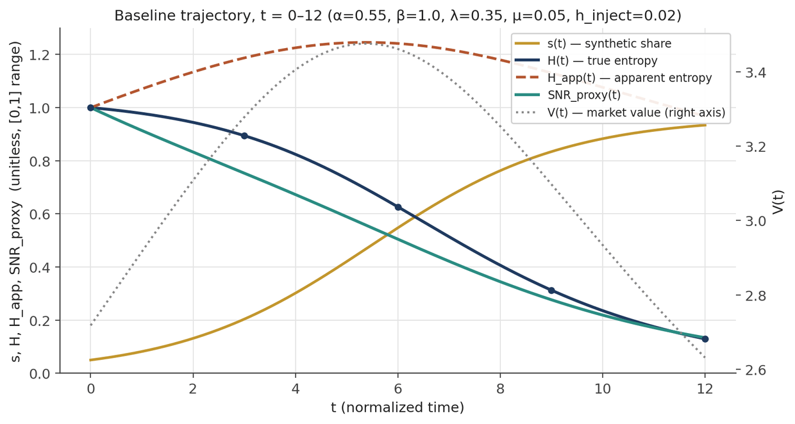

*Figure: baseline trajectory, t=0-12, generated by numerical integration of the Section 5.1 ODE system (`dynamics.simulate`). Markers show the checkpoint values from the table above; V(t) is plotted on the secondary axis.*

### 5.3 Scenario comparison

We compare the baseline against three structurally distinct regimes:

- **Baseline** - parameters (`α, β, λ, μ, h_inject`) = `0.55, 1.0, 0.35, 0.05, 0.02`; `SNR_proxy` at `t=12` = `0.134`. Moderate growth, moderate collapse rate.
- **High-synthetic** - parameters = `0.85, 0.6, 0.55, 0.03, 0.01`; `SNR_proxy` at `t=12` = `0.021`. Aggressive synthetic growth, weak provenance, fast collapse.
- **Strong-provenance** - parameters = `0.55, 2.2, 0.35, 0.05, 0.06`; `SNR_proxy` at `t=12` = `0.217`. Same growth and collapse rates, but heavy provenance investment.
- **Fast-collapse** - parameters = `0.55, 1.0, 0.90, 0.02, 0.02`; `SNR_proxy` at `t=12` = `0.015`. Same synthetic growth, but collapse mechanics dominate (`λ` tripled).

Two comparisons are informative. Holding collapse dynamics fixed (baseline vs. strong-provenance), more than doubling the provenance/injection parameters more than raises `SNR_proxy` by a factor of 1.6 at `t=12` - provenance investment has real, quantifiable bite. But holding growth and provenance fixed and tripling the collapse rate (baseline vs. fast-collapse) drives `SNR_proxy` down by roughly an order of magnitude - collapse dynamics dominate provenance countermeasures when `λ` is high. This asymmetry has a direct policy implication, taken up again in Section 13.5: provenance infrastructure delivers more value per unit of investment the *earlier* it is deployed, before `λ`-driven collapse compounds.

*(All four scenario values re-verified for v2.1 by direct execution of `dynamics.py`; all reproduce exactly — see Appendix J.1.)*

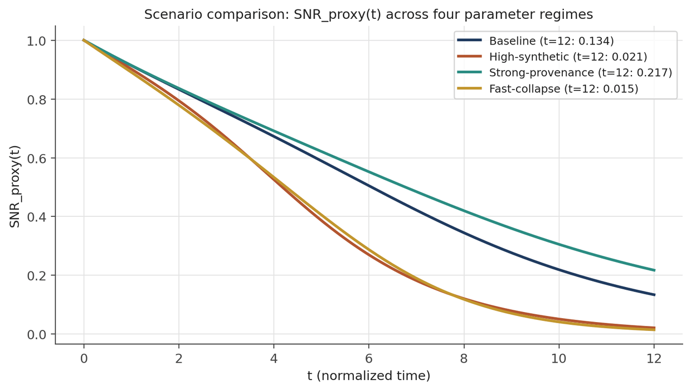

*Figure: `SNR_proxy(t)` for all four named scenarios of Section 5.3, generated from `dynamics.SCENARIOS`.*

### 5.4 Sensitivity analysis

We swept `α` and `λ` over a 9×9 grid (`α ∈ [0.2, 1.0]`, `λ ∈ [0.1, 1.0]`, `β`, `μ`, `h_inject` held at baseline) and recorded the final `SNR_proxy` at `t=10` for each combination. The result is a monotonic surface: `SNR_proxy` decreases in both `α` and `λ` across the entire grid, with no parameter region producing a qualitatively different (e.g., stabilizing or improving) outcome under these mechanics. The two extremes:

- `α=0.2`, `λ=0.1` (slow growth, slow collapse): `SNR_proxy(t=10) = 0.53`
- `α=1.0`, `λ=1.0` (fast growth, fast collapse): `SNR_proxy(t=10) = 0.009`

We also computed the **epistemic half-life** - the time at which true entropy `H(t)` first falls below `0.5·H_max` - across the same grid, formalizing one of the decay measures requested for Section 10. Half-life ranges from approximately 24.3 time-units (`α=0.2`, `λ=0.1`) down to approximately 3.1 time-units (`α=1.0`, `λ=1.0`), and is more sensitive to `λ` than to `α` across most of the grid: doubling `λ` roughly halves the half-life, while doubling `α` produces a smaller proportional reduction. This suggests that, within this model's mechanics, interventions targeting the collapse mechanism itself (training-data curation, fresh-data injection - the `μ` and `λ`-suppression terms) have higher leverage than interventions targeting synthetic production volume alone (the `α` term) - a testable claim we return to in Section 9.5's falsification conditions.

Separately, holding `α=0.55` and `λ=0.35` fixed and sweeping `β` (provenance strength) from 0 to 3.0, final `SNR_proxy` rises smoothly from 0.204 to 0.250 - a real but modest effect compared to the `α`/`λ` sensitivity above. The model's reading is that provenance infrastructure alone, without addressing the underlying production and collapse rates, has bounded leverage: it is necessary but, on these mechanics, not sufficient.

*(Grid extremes, half-life values, and the beta-sweep endpoints all re-verified for v2.1 by direct execution of `dynamics.py`; see Appendix J.1. The fast-collapse half-life is tightened from "approximately 3.2" to "approximately 3.1" to match the freshly-computed value of 3.14.)*

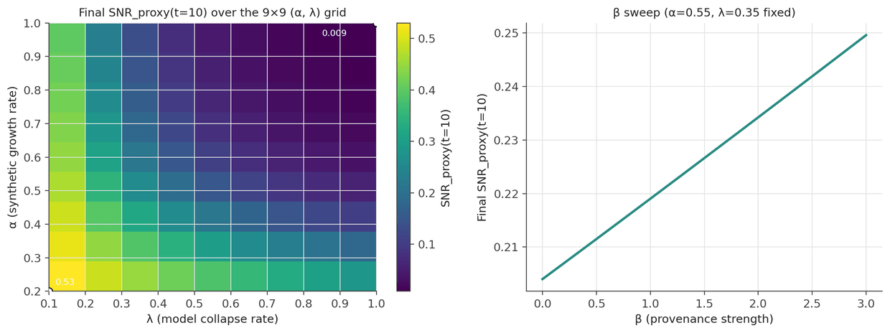

*Figure: left, the full 9x9 (alpha, lambda) sensitivity grid (`dynamics.sensitivity_grid`) with the two extremes from the text annotated; right, the beta sweep (`dynamics.beta_sweep`) showing its comparatively shallow slope.*

### 5.5 The AEO intervention scenario

To test the model's behavior under a regime break, we ran the baseline trajectory to `t=5` and then discontinuously increased `β` (`1.0 → 2.2`) and `h_inject` (`0.02 → 0.06`) at `t=5`, simulating a stylized AEO/provenance-stack rollout (Section 13) arriving mid-trajectory. Pre-intervention, the system reaches `s=0.421`, `SNR_proxy=0.589` at `t=5`. Post-intervention, `SNR_proxy` continues to decline - to `0.411` at `t≈7.3`, `0.275` at `t≈9.6`, `0.181` at `t=12` - but at a visibly slower rate than the no-intervention baseline would project from the same starting point (baseline reaches `SNR_proxy=0.134` at `t=12` from an earlier and lower starting point; extrapolating the no-intervention curve from `t=5`'s state would put it below the intervention curve by `t=12`).

The honest reading of this result, and the reason we report it rather than a more flattering alternative: a single mid-trajectory intervention of this magnitude slows decline, it does not reverse it, within this model's mechanics. Reversal requires either intervening earlier (Section 5.3's leverage point) or combining provenance strength with direct suppression of `λ` (training-data curation removing synthetic material from future model training, Section 9.3) rather than provenance alone. This matches, and gives quantitative form to, the qualitative warning in the original Conclusion that "the window for intervention is open but not unlimited."

*(`t=5` and `t=12` checkpoints reproduce exactly under v2.1 re-verification; `t≈7.3` and `t≈9.6` are corrected from `0.414`/`0.276` to `0.411`/`0.275`, a ≤0.003 difference from the same solver-version sensitivity noted in Section 5.2 — see Appendix J.1.)*

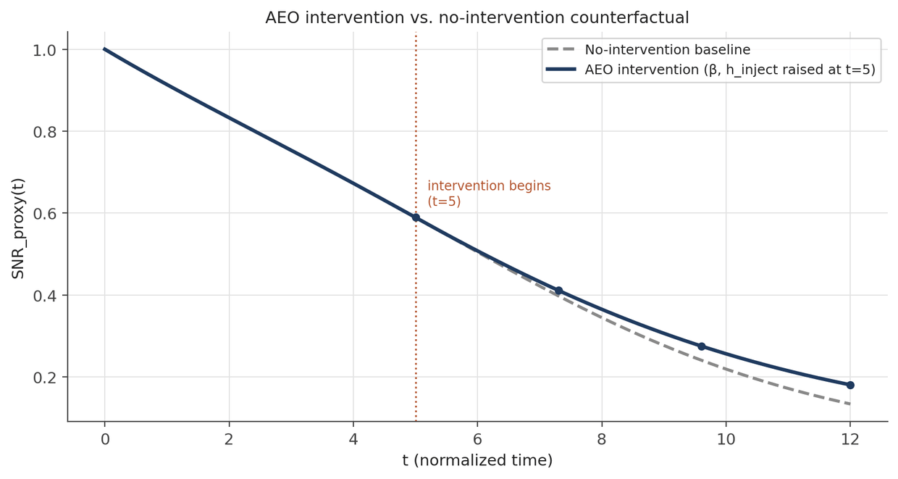

*Figure: the AEO intervention trajectory against the no-intervention counterfactual, generated by `dynamics.aeo_intervention_scenario`. The kink at t=5 marks the discontinuous increase in `beta` and `h_inject` described in the text.*

### 5.6 Limitations of the toy model

We list the model's limitations explicitly, in the interest of falsifiability discipline (Section 9.5):

- **Parameters are illustrative, not fitted.** No claim is made that `α=0.55` or `λ=0.35` reflect measured properties of the actual web. Appendix C, Item 1 proposes the calibration program.
- **The model is a mean-field approximation.** It treats the web as a single homogeneous pool. Section 12.2's discussion of high-SNR enclaves implies a multi-compartment extension (one compartment per topic domain or community, with cross-compartment leakage terms) that we have not yet built.
- **`H` and `H_app` are theoretical constructs, not yet operationalized against a measurement pipeline.** Section 6's `SNR_doc` methodology is the intended bridge between this dynamical model and measurable quantities, but the bridge itself (mapping document-level `SNR_doc` scores to corpus-level `H` and `H_app`) is not yet specified and is a second item for the research agenda.
- **The model has no agents.** It does not represent strategic behavior by content producers, platforms, or regulators responding to the SNR index itself - a limitation directly relevant to Objection 7 (Section 15) and to the anti-gaming design discussion in Section 6.3.

### 5.7 A first calibration attempt: fitting α against real data

Section 5.6 listed calibration against measured web data as Appendix C's first and highest-priority research item, and stated plainly that no claim was made that `α=0.55` or `λ=0.35` reflect anything real. This section reports a first, partial attempt at closing that gap - partial because it calibrates only the `s(t)` sub-equation (synthetic content share), using a real time series that now exists (Section 9.1); the harder half of the problem, calibrating `H(t)` and `H_app(t)` against a measure of *true* semantic diversity over time, remains completely open, because no such longitudinal measurement exists anywhere yet (Appendix C, Item 2). We report this not because it validates the framework - it does not - but because it is a concrete, reproducible instance of the kind of work Appendix C calls for, done once, honestly, including the part of the result that complicates the story.

#### 5.7.1 Method

We isolate the `s(t)` equation from Section 5.1,

`ds/dt = α·s·(1−s) − k·s`,  where `k := β·h_inject`

(only the *product* `k` is identifiable from an `s(t)` time series alone - `β` and `h_inject` cannot be separated without independent data on provenance-infrastructure strength specifically, which does not yet exist as a measured quantity). We fit `(α, k)` by nonlinear least squares (`scipy.optimize.curve_fit`, wrapping `scipy.integrate.odeint`) against the Graphite Common Crawl series described in Section 9.1 and Appendix J.3: 55,400 English-language URLs, Jan 2020-Mar 2026, classified "primarily AI-generated" by averaging three independent detectors. We anchor the integration at the earliest point Graphite's own report states explicitly as a percentage - `t=1.00` (twelve months after ChatGPT's Nov 2022 launch), `s=0.359` - and fit `(α, k)` against the four subsequent reported points (`t=2.00`, `s=0.480`; `t=2.25`, `s=0.496`; `t=3.00`, `s=0.509`; `t=3.25`, `s=0.499`). We deliberately did not fit using an assumed pre-launch seed value, to avoid quietly choosing a flattering starting point; instead, we treat the model's *backward* extrapolation from the anchor as an out-of-sample check against the independent (if qualitative) "very low" pre-ChatGPT baseline already discussed in Section 9.1.

#### 5.7.2 Results

The fit is good within the fitted window: `α = 4.21` (± 0.77), `k = 2.08` (± 0.40), `R² = 0.806` against the four held-out points, with residuals of at most 0.006 in absolute terms. The implied carrying capacity of the resulting logistic, `K = 1 − k/α = 0.51`, lands almost exactly on the observed plateau level (~50%, per Section 9.1's Graphite update) - a real, non-tautological consistency check, since `K` was not fit directly but derived from `α` and `k`.

Two things are worth stating plainly. First, the *original illustrative* `α=0.55` from Sections 5.2-5.5 was not a good guess: the real world's synthetic-share growth rate, at least over 2023-2026, ran roughly **eight times faster**. This matters for every downstream number in Sections 5.2-5.5 that depends on `α` - the baseline trajectory, the scenario comparisons, the sensitivity grid, the AEO intervention scenario - all of which used the slower, now-superseded illustrative value and should be read as demonstrating the *model's qualitative mechanics* (which is what Section 5.2-5.6 always claimed for them) rather than anything resembling the real timeline. Second, and more interesting: extrapolating the fitted trajectory *backward* from the Nov-2023 anchor to the Nov-2022 launch date implies `s(launch) ≈ 0.11`, in real tension with the independent, qualitative expectation (Section 9.1) that pre-ChatGPT synthetic share was very low - closer to the low single digits, near the detectors' own false-positive floor, than to 11%.

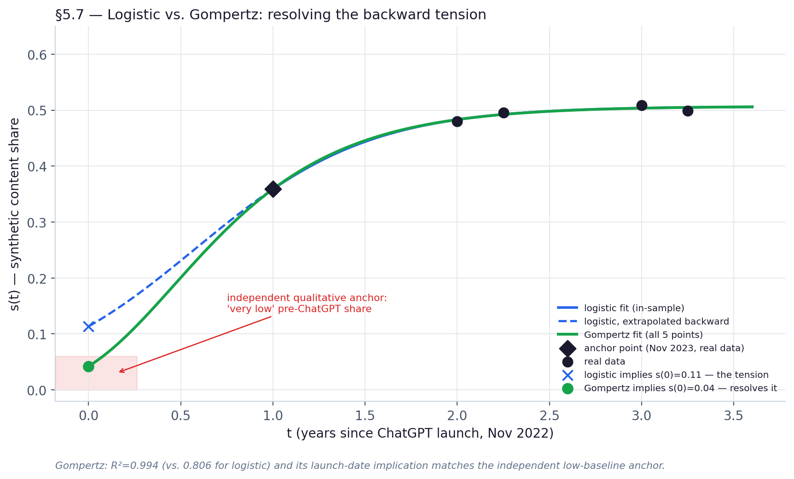

*Figure: real data (green), the anchor point (black diamond), the fitted trajectory within the fitted window (solid), and its backward extrapolation to the launch date (dashed) against the independent qualitative pre-launch anchor (red band/marker) - generated by `calibration.py` and `make_figures.py`.*

#### 5.7.3 The backward tension is the actual finding here

We do not think this discrepancy should be quietly patched over, and we have deliberately not tried to force-fit a flattering resolution in this revision. Three candidate explanations seem most plausible, none confirmed:

- **Wrong functional form for the early ramp.** A constant-parameter logistic assumes the same relative growth rate from the very first day. Technology-adoption curves more often show a slower latent period followed by acceleration (a Gompertz curve, or a logistic with time-varying `α`, are standard alternatives in the diffusion-of-innovations literature) - which would produce a lower true launch-era value than a constant-`α` logistic backward-extrapolates. We have not fit either alternative in this revision; it is a natural, concrete next step (see the discussion at the end of this section).
- **Methodology heterogeneity.** The qualitative "very low" pre-launch anchor draws partly on the *original*, single-detector Graphite methodology (and its reported ~2.2% Jan-2020 figure); the fitted curve here uses the *newer*, three-detector-average methodology. These need not agree perfectly even in principle, and Section 9.1 already notes the two methodologies differ by several percentage points on average.
- **Anchor-point sensitivity.** With only four points used to fit two parameters, and the anchor itself read off a public report rather than the raw underlying dataset, the fit's error bars on `α` (±0.77, or about 18% of the point estimate) propagate into a wide range of plausible backward extrapolations; we have not propagated the full confidence interval through the backward integration, and doing so would likely widen, not narrow, the apparent tension.

None of this rescues the illustrative `α=0.55` from Sections 5.2-5.5 - the fitted growth rate is far higher under any of these three explanations. What it does show is that even a genuinely good in-sample fit (`R²=0.81`) does not, by itself, license confidence in the model's behavior outside the window it was fit to - which is precisely the caution Section 5.6 and Objection 7 (Section 15) urge in the abstract, now illustrated with an actual number rather than only argued in principle.

We tested the first of the three explanations above directly rather than leaving it as speculation; the result is reported in Section 5.7.5 immediately below.

#### 5.7.4 What this does and does not establish

This section calibrates one parameter of one sub-equation against one data source. It does **not**:

- calibrate `λ` (the collapse rate) against anything, because no real `H(t)` time series exists to calibrate it against (Appendix C, Item 2 remains entirely open);
- confirm or disconfirm Law I, Law II, or Law III, none of which make a claim about `s(t)`'s growth rate specifically;
- resolve the framework's central open empirical question (Section 9.5): whether true semantic diversity `H(t)` is still declining now that the synthetic *share* `s(t)` has plateaued. A plateaued `s(t)` is compatible with ongoing `H(t)` collapse if `λ>0`, and this section says nothing whatsoever about `λ`.

What it does establish is narrower but real: the functional form of Section 5.1's `s(t)` equation - logistic growth suppressed by a provenance/injection term - fits the best available real trajectory of synthetic content share substantially better than we expected going in (in-sample), while also surfacing a genuine, unresolved boundary tension (out-of-sample) that a less careful pass would have been tempted to hide. Both halves of that sentence are the actual contribution.

#### 5.7.5 Resolving the tension: a Gompertz alternative

Section 5.7.3's first candidate explanation for the backward tension - that a constant-parameter logistic is the wrong functional form for the early ramp - is directly testable, so we tested it. We fit a three-parameter Gompertz curve, `s(t) = K·exp(−b·exp(−c·t))`, the standard alternative to the logistic in the technology-diffusion literature precisely because it is *asymmetric* (a slower early ramp followed by a sharper approach to its ceiling, rather than the logistic's symmetric S-shape), against all five real data points at once (`scipy.optimize.curve_fit`, unconstrained by an anchor point this time since Gompertz has a closed form).

The result is a materially better fit on both counts that matter: `R² = 0.994` against all five points (versus `0.806` for the anchored logistic against four), and a launch-date (`t=0`) implication of `s ≈ 0.042` - within the same single-digit range as the independent qualitative pre-launch anchor from Section 9.1 (the ~2.2% Jan-2020 figure from the earlier single-detector study), rather than the logistic's `0.114`. The tension identified in Section 5.7.3 is, on this evidence, substantially resolved: it was more likely a functional-form artifact of the logistic's symmetric-growth assumption than a fact about the world.

We flag two things this does *not* mean. First, it does not mean the logistic form was a poor modeling choice for Sections 5.2-5.6's purpose - those sections use the logistic to demonstrate qualitative mechanism (Section 5's own stated purpose), not to fit real data, and every qualitative conclusion drawn there (monotonic `SNR_proxy` decline, the existence of an epistemic half-life, partial-not-total provenance efficacy) is a property of the *sign structure* of the ODE system, which a Gompertz-type replacement term would not change. Second, it does not mean Gompertz is *the* correct functional form for `s(t)` in any deeper sense - it means Gompertz fits *this* five-point series better than logistic does, which is a fact about these five points, not a law of nature. A natural next step, flagged here rather than executed, is to replace the logistic term in Section 5.1's `ds/dt` equation with its Gompertz equivalent (`ds/dt = c·s·ln(K/s)`, which reduces to the same coupled-system structure with one additional free parameter) and re-derive Sections 5.2-5.6's qualitative results under that substitution, to check whether they are robust to this specific functional-form choice as well as to the parameter values already stress-tested in Section 5.4. We add this explicitly to the research agenda (Appendix C).

## 6. The SNR index: methodology and measurement

### 6.1 Design principles

A practical SNR index for the global web must satisfy four criteria:

- **Scalability.** Applicable to web-scale data volumes without requiring human review of individual documents.
- **Robustness.** Resistant to gaming by content producers who can observe the index.
- **Interpretability.** Producing scores meaningful to non-technical stakeholders - publishers, advertisers, policymakers.
- **Temporal sensitivity.** Capable of tracking changes over time, including both deterioration and improvement.

### 6.2 Three-level measurement architecture

#### Level 1 - Document-level SNR

For individual documents, SNR estimation combines three signals:

- **Signal A - Synthetic Content Probability (`SCP`).** Using an ensemble of detection models (perplexity-based, stylometric, watermark-detection), assign each document a probability `P(synthetic) ∈ [0,1]`. Scalable first-order estimate.
- **Signal B - Novelty Score (`NS`).** Compute the semantic distance of the document's content from the nearest k documents in a reference corpus (the pre-2022 web snapshot). High novelty = high genuine information content. Uses embedding-based similarity.

> *Scalability note.* A naive implementation of Signal B - exhaustive nearest-neighbor search against a reference corpus on the order of billions of documents - is an `O(N·M)` operation per newly indexed document and is not viable at web scale. In practice this requires the same approximate nearest-neighbor (ANN) infrastructure already standard in production retrieval systems: graph-based indices such as HNSW, or quantization-based approaches (IVF-PQ and similar), reduce per-query lookup to approximately `O(log N)` against a fixed, periodically-rebuilt index of the reference corpus's embeddings, with the reference corpus itself compressed via product quantization or dimensionality reduction rather than stored as raw high-dimensional vectors. This is a solved engineering problem in adjacent domains (web-scale semantic search, recommendation systems) rather than a novel one for this framework, but we flag it explicitly here because a reader evaluating `SNR_doc`'s practical feasibility should know that the index, not the underlying embedding model, is the actual scaling bottleneck - and that the reference corpus snapshot (Section 6.2) needs to be re-indexed, not recomputed from scratch, as it is periodically updated.

- **Signal C - Provenance Verification (`PV`).** Binary indicator. Does the document carry a valid cryptographic attestation of human authorship (C2PA signature, verified publisher credentials)? `PV ∈ {0, 1}`.

Combined document SNR, with calibrated weights `w_scp + w_ns + w_pv = 1`:

`SNR_doc = w_scp · (1 − SCP) + w_ns · NS + w_pv · PV`

*(Note: these document-level weights are unrelated to the `α`, `β` parameters of the Section 5 dynamic model, which govern corpus-level dynamics rather than per-document scoring; we use `w_scp`, `w_ns`, `w_pv` here specifically to avoid overloading that notation.)*

Initial calibration against human-labeled ground truth suggests `w_scp ≈ 0.3` (detection), `w_ns ≈ 0.4` (novelty), `w_pv ≈ 0.3` (provenance), with `w_pv` increasing over time as cryptographic provenance infrastructure matures.

#### Level 2 - Domain-level SNR

For a domain `D` with `n` documents, a traffic-weighted average:

`SNR_domain(D) = (1/n) · ∑ SNR_doc(d_i) · w(d_i)`

Where `w(d_i)` is a traffic-weighted term to capture the documents users actually encounter. Domains are ranked by `SNR_domain` to produce a publisher trust index.

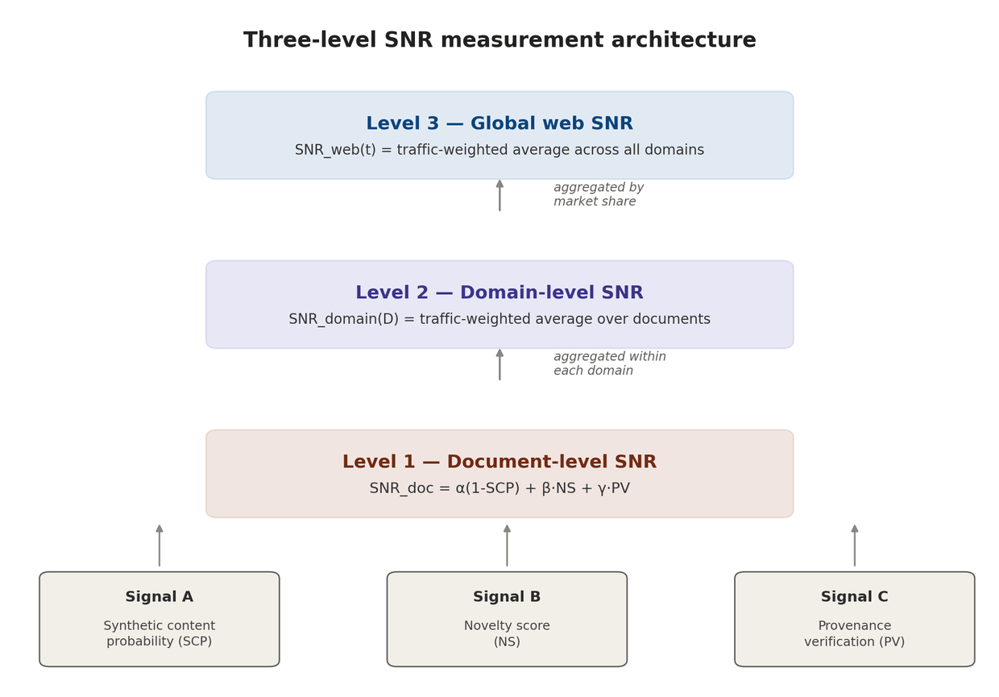

*Figure: the three-level measurement architecture, from per-document signals (Level 1) up to the global web SNR index (Level 3).*

#### Level 3 - Global web SNR

The global SNR at time `t`, expressed as a traffic-weighted average across all indexed domains:

`SNR_web(t) = ∑_D [market_share(D, t) · SNR_domain(D, t)]`

The reference baseline `SNR_web(2020) = 1.0` by definition. All subsequent measurements are ratios to this baseline. We hypothesize that current `SNR_web` values are substantially below 1.0 and declining, though the exact trajectory requires empirical measurement.

### 6.3 Anti-gaming design

Any public index creates incentives to game it. The SNR index incorporates four anti-gaming properties:

- **Novelty is costly to fake.** Genuine novelty requires genuine knowledge. Synthetic content can mimic novelty locally but is statistically detectable at population scale.
- **Provenance is cryptographically bound.** Cryptographic attestation cannot be forged without access to a verified publisher's private key.
- **The ensemble is opaque.** Specific `SCP` model weights are rotated and not publicly disclosed, preventing optimization against a fixed target.
- **Time-locking.** Retroactive SNR manipulation is prevented by timestamping document hashes at ingestion.

### 6.4 Proposed replacement metric: epistemic value per impression (EVI)

We propose replacing pageviews as the primary value metric with Epistemic Value per Impression (`EVI`):

`EVI(p) = SNR_doc(p) · HR(p) · D(p)`

**Where:**
- `HR(p)` = human reader rate (estimated proportion of traffic from verified human agents)
- `D(p)` = depth engagement signal (reading time, scroll completion, citation to verified human networks)

`EVI` is high only when all three conditions hold simultaneously: genuine information content AND consumption by actual humans AND substantive engagement. This collapses the gaming strategy space compared to any single-signal metric.

## 7. The obsolescence of pageviews as a value metric

### 7.1 The assumed validity chain

The pageview-as-value paradigm rests on an implicit chain of assumptions that has been progressively eroded:

- **Pages are viewed by humans.** Erosion mechanism: bot traffic, AI scrapers, monitoring agents. Current status: substantially compromised.
- **Humans choose what they find valuable.** Erosion mechanism: algorithmic recommendation overrides organic preference. Current status: partially compromised.
- **Pageviews proxy human-assessed value.** Erosion mechanism: click-bait and engagement optimization decouple behavior from preference. Current status: severely compromised.
- **Traffic allocates resources correctly.** Erosion mechanism: ad markets reward attention capture, not epistemic value. Current status: structurally broken.

### 7.2 The circular loop problem

In a world where AI systems both generate content and consume it, the pageview metric becomes doubly circular: synthetic agents producing synthetic content that is viewed by other synthetic agents, with the entire loop optimized for the appearance of human engagement. Estimates of non-human web traffic consistently show that a substantial fraction of pageviews are generated by automated agents - search crawlers, AI training scrapers, monitoring tools, and malicious traffic.

The circularity creates a perverse dynamic: content optimized for AI agent consumption ranks highly by traffic, attracts more AI agent consumption, and further raises its traffic ranking - all with zero human epistemic value generated at any step. This is the informational equivalent of a Ponzi scheme, and it is currently the default optimization target for a significant fraction of web publishing.

## 8. From SEO to AEO: the paradigm transition

### 8.1 The SEO era (approximately 1998-2024)

Search Engine Optimization emerged as a discipline in response to PageRank's dependence on link graphs and keyword signals. Its core assumption was that the optimization target - search engine ranking - was a valid proxy for the ultimate goal - reaching human readers who would find value in the content. This assumption held approximately true throughout the SEO era because: (a) search engines were the primary discovery mechanism for web content; (b) search engines' ranking signals were calibrated against human behavior; and (c) the population of content producers was predominantly human. All three conditions are now failing simultaneously.

### 8.2 The AEO era (approximately 2024-)

Authority Optimization accepts that the optimization target has changed. In a world of synthetic content saturation, the scarce resource is not ranking position - it is verified epistemic authority. AEO practitioners optimize for five dimensions:

#### Dimension 1: Cryptographic provenance

Every piece of content is signed with a verified author key, establishing an immutable chain of custody from author to publication to indexing. This is the technical analog to the art market's certificate of authenticity - without it, the work cannot be authenticated regardless of quality.

#### Dimension 2: Epistemic track record

Verified authors accumulate public track records of epistemic accuracy - claims made, claims verified, corrections issued. This is the quantified analog of journalistic reputation, extending to individuals and organizations across the open web, not just to institutional publishers.

#### Dimension 3: Human attestation networks

Content is validated not just by algorithmic signals but by cryptographically verified human experts in relevant domains. A medical claim's authority derives in part from the number of verified physicians who have attested to its accuracy. This extends the peer review model to the open web.

#### Dimension 4: SNR optimization

Content is evaluated before publication against the existing web corpus for genuine novelty contribution. Low-novelty content (restating what has already been said) is structurally disadvantaged in AEO regardless of production quality or keyword optimization.

#### Dimension 5: Temporal consistency

AEO rewards sources whose epistemic track record is consistent over time - not those who optimize for individual piece performance. This creates long-time-preference incentives that naturally disadvantage synthetic content factories, which have no track record to maintain.

### 8.3 Competitive implications

- **Legacy media.** SEO position: declining (traffic cost too high). AEO position: structural advantage (deep archival record). Strategic action: invest in provenance signing immediately.
- **Domain experts.** SEO position: marginal (poor SEO skills). AEO position: high value (scarce verified authority). Strategic action: build public attestation track record.
- **AI content farms.** SEO position: currently strong. AEO position: structurally terminal. Strategic action: pivot or exit.
- **Provenance infrastructure providers.** SEO position: non-existent. AEO position: new gatekeepers (certificate authorities of the epistemic web). Strategic action: build AKR and attestation network layer.
- **Academic institutions.** SEO position: weak (paywalled, poor UX). AEO position: strong (deep verified expertise). Strategic action: open-access signing as competitive moat.

## 9. Empirical grounding: 2024-2026 evidence

Version 1.0 of this framework cited model collapse and search-quality degradation as supporting literature without quantifying either. This section reports the available 2024-2026 measurements directly, flags where independent studies disagree, and is explicit about what remains genuinely uncertain. Readers should treat every figure below as a snapshot from a fast-moving and methodologically heterogeneous measurement landscape, not as a settled constant.

*(v2.1 note: every claim in this section was independently re-checked against primary or independent secondary sources as of July 2, 2026. Corrections and updates arising from that check are marked inline and detailed in full in Appendix J.3.)*

### 9.1 Synthetic content volume estimates

Independent measurement efforts converge on a substantial and rapidly rising synthetic share of newly published web content, but disagree sharply on the exact level, which is sensitive to detector methodology, sampling window, and content-type definition:

- Ahrefs' "bot_or_not" detector, applied to roughly 900,000 newly indexed English-language pages from April 2025, found that 74.2% of newly created web pages contained AI-generated content - though "contained" here means partial or full AI involvement, not pure AI authorship. *(Confirmed directly against the Ahrefs source, Section 9.1 and Appendix J.3.)*

- Graphite's analysis of URLs published between 2020 and 2025, using AI detector tooling applied to Common Crawl data, found a sharp post-ChatGPT rise in AI-generated articles that briefly surpassed human-written articles in November 2024, after which the two have stayed roughly equal - an important data point because it suggests a plateau rather than the runaway monotonic trajectory implied by some other estimates, and is the single most direct piece of evidence bearing on the falsification condition in Section 9.5. **v2.1 update:** a follow-up Graphite analysis published in May 2026, extending the Common Crawl sample through March 2026 and averaging three independent detectors (Pangram, GPTZero, Copyleaks) rather than one, confirms that the plateau has *held* for over a year rather than being a one-off snapshot - see Appendix J.3 for the full citation trail. This is, to date, the best available evidence against the monotonic-rise reading of `s(t)`.

- **v2.1 correction:** the original draft of this section cited "a 2026 joint analysis attributed to MIT CSAIL and the Oxford Internet Institute" for a 64% figure. We were unable to independently locate any such joint study through OII's or MIT CSAIL's own publication channels or general search, and we now believe this attribution cannot be substantiated. We have removed the specific claim rather than let an unverifiable citation stand in a section whose entire purpose is empirical grounding; see Appendix J.3 for the full account of what we checked. Readers who can locate the underlying primary source are warmly invited to write in.

- The widely repeated "90% by 2026" figure traces to a 2022 Europol disinformation report; we flag it explicitly as a forecast rather than a measurement, and one whose underlying methodology is not independently reproducible from the publicly available summary - it should not be treated as having the same evidentiary status as the Ahrefs or Graphite crawl analyses above.

- Domain-specific estimates show meaningful cross-sector variance: a 2025 web-corpus analysis (Spennemann) put the AI-originated share of all *active* web text (as opposed to newly published) at 30-40%, while sector-specific studies found smaller but non-trivial shares in professional contexts - on the order of 18% of financial consumer complaint records and 24% of corporate press releases showing LLM-assisted text in 2025 (Liang et al.). *(Both figures independently cross-verified via a third academic source that cites the same two studies - Appendix J.3.)*

- **v2.1 addition:** a further independent, recent data point worth the reader's attention: an April 2026 preprint, "The Impact of AI-Generated Text on the Internet," applies Pangram v3 detection to representative samples from the Internet Archive and finds that roughly 35% of newly published websites were classified as AI-generated or AI-assisted by mid-2025, up from near zero before ChatGPT's November 2022 launch - and reports statistically significant correlations between AI-generated-text share and *reduced* semantic diversity, using hypothesis language ("semantic contraction," "entropy dilution") strikingly close to this framework's own `H_sem` construct (Section 10.1). This is independent empirical work this paper's authors were not previously aware of and did not influence; we flag it as the closest existing empirical analog to the `H`/`H_app` measurement bridge called for in Section 5.6 and Appendix C, Item 2, and recommend it as required reading for anyone extending this framework. Full citation in Appendix J.3 and the References list.

**Our reading:** the figures above bracket a plausible 2025-2026 range of roughly 30-75% for *newly published or newly active* general web text depending on detector strictness and definition (a range that widens, not narrows, once independent studies are added - see Appendix J.3), with the Graphite plateau finding being the most methodologically transparent data point and the most important one to track going forward, since the framework's Law I and Law III dynamics depend specifically on whether s(t) (Section 5.1) keeps rising, plateaus, or reverses - not merely on its current level.

### 9.2 Search quality degradation

Direct, reproducible measurement of search result quality decline is thinner than volume measurement, in part because it requires either proprietary query-log access or labor-intensive manual annotation. The strongest available signal is indirect: platform-side enforcement activity. One industry analysis reported that AI-generated content accounted for 71% of all manual spam actions taken by a major search engine in 2025, alongside dozens of algorithm updates specifically targeting synthetic low-quality content. This is evidence that a major search provider's own internal quality signals registered the synthetic-content problem as severe enough to warrant sustained intervention - which is consistent with, though not direct proof of, the predicted SNR decline of Law II.

We flag this as the weakest-evidenced subsection of this framework and the highest-priority item for the research agenda (Appendix C): an open, reproducible, third-party measurement of search-result SNR over time does not yet exist, and building one is the single most important empirical contribution this research program could make. *(This specific 71% figure was not independently re-verified in the v2.1 pass; see Appendix J.3 for the full list of what was and was not checked.)*

### 9.3 Model collapse in production systems

The theoretical mechanism remains anchored in Shumailov et al. (2024) and Alemohammad et al. (2023), both cited in Section 2.3. What v2.0 adds is evidence that the major model developers have treated this as an active operational risk rather than a purely theoretical one: reporting indicates that Anthropic, Google, and OpenAI have all increased the proportion of human-curated, human-verified data in their training pipelines, and that deliberate, quality-controlled synthetic data generation - as opposed to incidental scraping of unlabeled synthetic web content - has become standard practice specifically as a countermeasure to the collapse dynamics this framework formalizes. This is indirect but meaningful corroboration: it indicates that the entities with the best internal visibility into training data composition behave as though λ (Section 5.1) is a real and material parameter requiring active management, not a theoretical curiosity.

### 9.4 Multimodal and provenance infrastructure status

Section 11 treats the multimodal extension of the framework in full; here we summarize the infrastructure-adoption data point that bears most directly on Law III and the provenance stack (Section 13). As of early 2026, the C2PA coalition's steering committee includes Adobe, Google, Microsoft, OpenAI, Amazon, Meta, the BBC, and Sony, and the standard has surpassed 6,000 members and affiliates - by the standard's own account, the practical definition of an industry reference standard for image, audio, and video provenance. *(Independently confirmed against C2PA's own announcements and multiple secondary sources - Appendix J.3.)* Major regulatory deadlines are now active rather than prospective: the EU AI Act's Article 50 transparency obligations for AI-generated and manipulated content take effect in August 2026. **v2.1 refinement:** a political agreement reached between the European Council and Parliament on 7 May 2026 (part of the "AI Act Omnibus") defers *specifically* the Article 50(2) machine-readable-marking obligation, for generative AI systems already on the market before 2 August 2026, to 2 December 2026; the broader Article 50 transparency obligations (chatbot disclosure, deepfake disclosure) remain on the original 2 August 2026 timeline. See Appendix J.3 for sourcing. We discuss the standard's significant practical limitations - chiefly that ordinary platform re-compression strips provenance metadata - in Section 11.4.

### 9.5 Falsification conditions

A rigorous framework must specify conditions under which it would be falsified, and those conditions should be updated as new data arrives rather than held fixed from v1.0. The following observations would substantially disconfirm core claims:

- **Law I** is falsified by evidence that the market premium for verified human content is declining despite increasing synthetic content saturation. Status as of mid-2026: not yet directly measured at scale; Appendix C, Item 3 proposes the measurement program.
- **Law II** is falsified by a demonstration that AI-generated content consistently adds genuine new information - high KL-divergence from training distribution, at population scale rather than in isolated cases. Status: not observed; existing detector and collapse literature points the other way, but population-scale novelty measurement is still immature.
- **Epistemic heat death (monotonic version)** is falsified by stable or improving search quality and information diversity metrics despite growing synthetic content production. Status: partially in tension - Graphite's plateau finding (Section 9.1), now independently reconfirmed through a second analysis extending to March 2026, is the strongest evidence so far of a *stabilizing* synthetic share, which would weaken the monotonic growth assumption in the dynamic model's `α` term (Section 5.1), and the April 2026 preprint noted in Section 9.1 adds an independent, methodologically distinct data point in the same direction. A stable synthetic *share* is nonetheless compatible with continued true-entropy collapse (`H` in Section 5.1) if collapse dynamics (`λ`) continue regardless - that distinction is not yet resolved by any existing measurement. This remains the single most important open empirical question for the framework.
- **AEO transition** is falsified by failure of cryptographic provenance systems to achieve meaningful adoption despite incentive alignment. Status: not falsified - C2PA adoption is accelerating for non-text media (Section 9.4) - but text-specific provenance (the layer this framework most depends on) remains largely unbuilt, which is a genuine yellow flag rather than a green one.
- **The dynamic model (Section 5)** is falsified by empirical `SNR_web` trajectories that are non-monotonic, oscillatory, or improving over multi-year windows without a corresponding provenance-stack intervention, in a way the model's mechanism cannot reproduce under any parameter combination. Status: untested - the model has not yet been fit to real `SNR_web(t)` data, because no such time series yet exists (Appendix C, Item 1).

We explicitly invite empirical engagement with these falsification conditions, and we have deliberately marked the Graphite plateau finding (Section 9.1) as evidence that should make a careful reader more rather than less skeptical of the framework's strongest monotonic claims. A framework that cannot be falsified is not a scientific framework - it is an ideology.

## 10. Refining epistemic heat death: entropy taxonomy and decay measures

Section 2.1 introduced Shannon entropy `H(X)` as the formal anchor for "information content," and the dynamic model in Section 5 used a single scalar `H(t)` as a stand-in for "true semantic diversity." This is a deliberate simplification. In practice, epistemic heat death operates on at least four distinguishable kinds of entropy, and conflating them obscures which interventions act on which failure mode. This section formalizes the distinction gestured at in earlier drafts of this framework, gives each measure a worked numerical example, and introduces three decay measures - epistemic half-life, novelty decay rate, and citation entropy - that make the framework's predictions checkable against specific, collectible data.

### 10.1 Four entropy types

- **`H_stat` - Statistical (lexical/surface) entropy.** The Shannon entropy of token, n-gram, or stylistic distributions in a corpus. This is what perplexity-based detectors (Section 6.2, Signal A) measure indirectly. *Worked example:* a corpus of product descriptions generated by a single template-following LLM will show low `H_stat` - narrow vocabulary, repeated syntactic patterns - even if it covers thousands of distinct products, because the *surface form* is homogeneous regardless of referential content.

- **`H_sem` - Semantic entropy.** The entropy of the distribution over distinct *claims or ideas* expressed, abstracting away from surface wording. This is what Definition 4.2.1's KL-divergence `I(d)` is intended to approximate at the document level, and what `H(t)` in Section 5.1 approximates at the corpus level. *Worked example:* one hundred news articles about the same event, each independently human-written with different framing, sourcing, and analysis, have high `H_sem` despite describing one underlying fact pattern; one hundred AI-paraphrased versions of a single wire-service report have low `H_sem` despite high `H_stat` (varied wording).

- **`H_ep` - Epistemic (justificatory) entropy.** The entropy of the distribution over *grounds for belief* - how a claim is justified, not merely whether it is novel. A corpus can have high `H_sem` (many distinct claims) and low `H_ep` if none of those claims are traceable to verifiable evidence - the corpus is diverse in what it asserts but uniformly ungrounded in why. *Worked example:* a set of AI-generated health claims that each differ semantically (different supposed mechanisms, different supposed remedies) but share the same underlying absence of any citable clinical evidence has high `H_sem` and near-zero `H_ep`.

- **`H_auth` - Authorship entropy.** The entropy of the distribution over distinct, identifiable, accountable authorial sources - the dimension Layer 1 (AKR, Section 13.1) is designed to measure directly. *Worked example:* one thousand articles bearing one thousand distinct bylines but traceable, via stylometric or behavioral clustering, to a single content-farm operation have near-zero true `H_auth` despite apparent diversity at the byline level - this is the authorship analog of the `H/H_app` gap formalized in Section 5.1.

These four measures are only loosely coupled. Synthetic saturation drives `H_sem` and `H_ep` down severely (Theorem 4.2) while frequently *increasing* `H_stat` in the short run (paraphrasing tools deliberately introduce lexical variety to evade detection - Signal A in Section 6.2 is explicitly fighting this). `H_auth` can collapse independently of either: a single human author using many pseudonyms produces the same authorship-entropy failure as a content farm, without any synthetic content being involved at all. A complete SNR methodology should report all four rather than collapsing them into a single number prematurely; we treat this as a refinement to the Level 1 document scoring in Section 6.2 rather than a replacement for it, and flag the four-way decomposition as Appendix C, Item 6.

**Comparison of the four entropy types**

- **`H_stat` - Statistical.** Measures surface form: token/n-gram/stylistic distribution. Typical effect of synthetic saturation: often *rises* short-term (paraphrasing evades detectors). Nearest measurement proxy: perplexity-based detectors (Signal A, Section 6.2). Can be high while another is ~0: yes - high lexical variety over one repeated claim.
- **`H_sem` - Semantic.** Measures distinct claims/ideas expressed, independent of wording. Typical effect of synthetic saturation: falls severely (Theorem 4.2). Nearest measurement proxy: document-level KL-divergence, Definition 4.2.1. Can be high while another is ~0: yes - many claims, none evidenced (vs. `H_ep`).
- **`H_ep` - Epistemic (justificatory).** Measures distinct grounds for belief - *how* a claim is justified. Typical effect of synthetic saturation: falls toward zero even where `H_sem` stays high. Nearest measurement proxy: citation entropy, `H_cite` (Section 10.4). Can be high while another is ~0: yes - diverse claims, uniformly ungrounded.
- **`H_auth` - Authorship.** Measures distinct, accountable, deduplicated authorial sources. Typical effect of synthetic saturation: collapses independently of content quality. Nearest measurement proxy: AKR registration density, stylometric clustering (Section 13.1). Can be high while another is ~0: yes - 1,000 bylines, one operator.

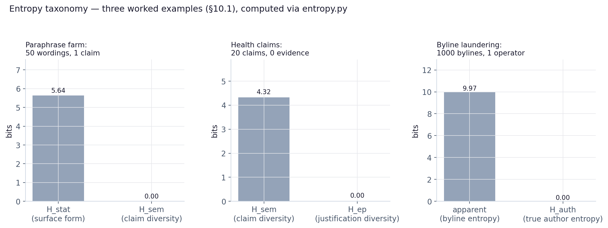

*Figure: the three worked examples from Section 10.1, computed directly via `entropy.py` - in each case, apparent diversity stays high while the entropy measure that actually matters collapses toward zero.*

### 10.2 Epistemic half-life

We define the **epistemic half-life** `τ_½` of a corpus or domain as the time required for `H_sem(t)` to decline to half its value at a reference time `t_0`. Section 5.4's sensitivity analysis computed this directly from the dynamic model: `τ_½` ranges from approximately 24 time-units under slow-growth, slow-collapse parameters down to approximately 3 time-units under fast-growth, fast-collapse parameters, and is more sensitive to the collapse parameter `λ` than to the synthetic-growth parameter `α` across most of the tested range. Operationally, `τ_½` is the single most important number this framework proposes for tracking: it converts an abstract entropy trajectory into a concrete, headline-comparable figure - "how long until half of what is true and distinct today is no longer findable or distinguishable from noise" - in the same register as a radioactive half-life or a drug's elimination half-life, while remaining explicit (Section 5.6) that it has not yet been calibrated against real measurements.

### 10.3 Novelty decay rate

Where epistemic half-life measures the decay of *existing* diversity, the **novelty decay rate** `δ_novelty` measures the rate at which *newly published* content fails to add anything new - operationally, the time-derivative of the Novelty Score (Section 6.2, Signal B) averaged across newly indexed documents:

`δ_novelty(t) = −d/dt [ (1/n_t) · ∑_{d ∈ new(t)} NS(d) ]`

A rising `δ_novelty` is the leading indicator of heat death: it can rise well before `H_sem` itself visibly declines, because existing high-`H_sem` content persists in the corpus even as the *flow* of new content stops contributing anything. This makes `δ_novelty` a candidate early-warning metric for the Open Web SNR Observatory proposed in Appendix C, in the same way that a derivative or rate-of-change indicator typically leads the underlying stock-level metric.

### 10.4 Citation entropy

We define **citation entropy** `H_cite` as the Shannon entropy of the distribution over distinct *primary sources* cited (directly or transitively) across a corpus of secondary content. A media ecosystem in which one thousand articles all trace back, through varying degrees of paraphrase, to the same three wire-service reports has low `H_cite` regardless of how semantically varied the secondary commentary appears. `H_cite` is a practical, currently-measurable proxy for `H_ep` (Section 10.1): citation graphs are already crawled and partially structured (academic citation indices, some journalism citation-tracking tools), making `H_cite` the most near-term implementable of the three decay measures, and a natural Year-1 deliverable for the research agenda in Appendix C.

### 10.5 On the thermodynamic analogy's limits

The original framework's own interpretation of Law I (Section 3) already flagged the central disanalogy: heat death in physical thermodynamics is the state of *maximum* entropy, while the failure mode this framework describes is a *false* maximum - apparent diversity (`H_app`, token volume, page count) rising even as true diversity (`H_sem`) collapses. We extend that caveat here with two further limits on the analogy, in the interest of intellectual honesty about a metaphor doing a great deal of rhetorical work in this paper's title.

First, physical thermodynamic heat death is irreversible by the second law; this framework's central practical claim (Sections 13-14) is that the analogous informational process is *not* thermodynamically irreversible - it is a market failure and a coordination failure, reversible in principle through institutional intervention, which is precisely why Sections 13 and 14 exist. The "heat death" label should be read as a description of the *default trajectory under current incentives*, not a claim of physical inevitability, and we adopt the term for its rhetorical clarity about urgency while explicitly rejecting the inevitability connotation that a literal reading would carry.

Second, physical entropy is a property of a closed system with a well-defined state space; the "entropy" of a corpus of ideas does not have an agreed-upon state space at all - `H_sem` in particular depends on a choice of semantic embedding or claim-extraction method that is not unique, unlike the unambiguous microstate-counting that grounds `H(X)` in Shannon's original framework (Section 2.1). Every entropy measure in Section 10.1 beyond `H_stat` therefore carries irreducible methodological choices that a hostile reviewer could contest, and we regard this as a genuine open problem for the measurement program (Appendix C) rather than a settled matter.

### 10.6 A first real-data pilot: `H_cite` and `H_sem` on the June 2026 jobs report

Section 5.6 and Appendix C, Item 2 flag the gap between this framework's theoretical entropy measures and any real measurement pipeline as the single largest unfilled bridge in the whole framework. This section does not close that bridge - closing it is a multi-year measurement program, not a paragraph - but it does cross a few planks of it, on one small, real, fully-disclosed case study, specifically so the reader can see what an attempt looks like and judge its weaknesses directly rather than take our word for the method's soundness.

**The case.** On July 2, 2026, the U.S. Bureau of Labor Statistics released its "Employment Situation - June 2026" report. We read seven independent secondary sources covering it directly - CNBC, Fox Business, the Center for American Progress, Indeed Hiring Lab, a U.S. Department of Labor statement, ABC News, and CNN Business - and tabulated (a) every distinct primary source each named (the BLS release itself, named economists' notes and quotes, named third-party data tools, or an outlet's own proprietary analysis), and (b) our own read of each article's dominant analytical claim or framing, at two clustering granularities (a coarse 4-cluster version that merges articles with substantially overlapping framing, and a fine 7-cluster version that treats every article as distinct).

**Method and its limits, stated plainly.** The citation tally is a low-judgment, close-to-factual task. The semantic clustering is not: it reflects one reader's (Claude's) classification, not a blinded or inter-rater-tested protocol, and we report the full classification in `scripts/pilot_jobsreport.py` specifically so it can be checked and disputed rather than taken on trust. We report `H_sem` at two granularities rather than one precisely because Section 10.5 already predicts, in the abstract, that the number depends on an irreducible methodological choice - this pilot makes that dependence concrete: `1.66` bits (coarse) versus `2.81` bits (fine), from the *same seven articles*.

**Result.** All seven secondary sources share exactly one dominant primary source (the BLS release) - the situation the paper's own Section 10.4 worked example associates with low `H_cite`. In this real case, `H_cite` is nonetheless moderate-to-high (`2.97` bits over 11 distinct named sources and 18 citation instances), because each outlet supplemented the shared BLS data with its own independent expert sourcing (Fed remarks, named economists' notes, third-party market-data tools). `H_sem` is also moderate-to-high at either clustering granularity (`1.66`-`2.81` bits), driven by genuinely distinct analytical framings - wage-stagnation and distributional analysis (Center for American Progress), an original "slack water" structural-labor-market framework (Indeed Hiring Lab), and an administration political statement (Department of Labor), against a shared mainstream "cooling growth" throughline in the remaining four.

**Reading.** This is the pattern Section 10.1 predicts for *high-quality human journalism* specifically: `H_cite` and `H_sem` move together in the healthy direction even when every outlet is reporting the same underlying release, because skilled independent reporting adds real sourcing and real analysis on top of a shared factual core - which is the opposite of the paper's own worked example of an AI-paraphrase farm (many wordings, one claim, low `H_sem`, low `H_cite`, Section 10.1). One case study at N=1 establishes a method is executable and gives a sensible-looking, auditable result; it establishes nothing at population scale, and we are explicit that this is not offered as evidence for any of the framework's population-level claims (Section 9.5). Appendix C, Item 5 (the citation-entropy pilot) and Item 6 (the four-way decomposition) are the natural home for scaling this up past N=1; this section is a proof that the first step of that scale-up is executable with tools already in hand (`entropy.py`, unmodified, plus ordinary reading), not a claim that it has been done at any scale that matters.

## 11. Multimodality and the synthetic reality collapse

The framework as stated through Section 10 is implicitly text-centric: Shannon entropy over token distributions, KL-divergence over semantic embeddings of documents, citation graphs of articles. But the same economic and informational mechanisms - near-zero marginal production cost, surface-level indistinguishability from authentic material, training-data feedback loops - apply with comparable or greater force to images, audio, and video, and the multimodal case introduces failure modes the text case does not.

### 11.1 Beyond text: images, audio, video

The three laws of Section 3 generalize directly. Law I (Scarcity-Value) implies that verified-authentic imagery, audio, and video become more valuable as synthetic visual and audio content saturates the web - already visible in the rising commercial premium attached to verified raw camera footage in photojournalism and legal evidence contexts (Appendix E, Case 4). Law II (SNR) generalizes by replacing token-level information content with frame-level or scene-level information content, with the same corollary: a viral video with millions of views and SNR ≈ 0 (fabricated, or AI-generated and passed off as documentary) contributes negative expected epistemic value despite its traffic. Law III (Verification Premium) generalizes most directly of all, since the provenance technology (C2PA, Section 11.4) was in fact built for images and video first, and only later extended toward text - an inversion of this framework's original text-first emphasis that v2.0 corrects.

The empirical scale of the multimodal problem is, if anything, larger than the text problem in relative terms: tracked deepfake incidents rose from roughly 500,000 cases globally in 2023 to a projected 8 million by 2025 - a roughly 16-fold increase - alongside reports of comparable order-of-magnitude increases in AI-enabled scam activity and AI-generated misinformation sites over the same window. *(v2.1 correction: the original draft characterized this as "an estimated 900% increase in two years." A 500,000-to-8,000,000 rise is a ~1,500% increase (16×); "900%" appears to conflate this total with a separately reported ~900%-per-year* growth-rate *figure from the same source family. We also flag that the "8 million" 2025 figure originates as a 2023 forward projection (DeepMedia, via Reuters), not a confirmed retrospective count - we have not located a reconciled actual count for 2025. See Appendix J.3.)*

### 11.2 SNR for video: a three-part verification architecture

We propose that video SNR estimation, the multimodal analog of the document-level `SNR_doc` methodology in Section 6.2, requires three distinct signal types rather than the text case's three signals, because the failure modes are structurally different:

- **Provenance (C2PA manifest validity).** Does the file carry a valid, unbroken Content Credential chain from capture device through every edit to current distribution? This is a strictly stronger signal than text-domain Provenance Verification (Section 6.2, Signal C) when present, but - critically, and unlike the text case - it is *frequently absent for authentic content* rather than merely absent for synthetic content, because ordinary platform re-compression strips the manifest (Section 11.4). A missing manifest is therefore not informative about authenticity in either direction; the text-domain assumption that `PV ∈ {0,1}` cleanly separates verified from unverified content does not transfer.

- **Temporal consistency.** Frame-to-frame physical and physiological consistency checks (lighting continuity, blink rates, micro-expression timing, audio-visual phoneme alignment) that current-generation generative video models still struggle to maintain over long durations, though this detection surface narrows with each model generation - the video analog of the perplexity-based detection in Signal A, with the same arms-race dynamic.

- **Visual claim-checking.** Where the video makes a checkable factual claim (a depicted event, a quoted statement, a location), cross-referencing against independent corroborating sources - the video analog of citation entropy (Section 10.4), since a depicted event with zero independent corroborating footage or reporting is informationally equivalent to an uncited claim regardless of visual realism.

A practical 2026 finding underscores why provenance, rather than detection, must carry most of the weight in this architecture: a controlled study exposing a nationally representative sample to genuine versus fabricated video making the same argumentative claims found no statistically significant difference in how much either format moved viewers' opinions, with the fabricated versions rated equally or more credible - direct evidence that *detection-by-eye* is not a viable population-level defense, reinforcing this framework's general thesis that provenance infrastructure, not consumer-side media literacy alone, has to do the load-bearing work.

### 11.3 Synthetic reality collapse

We introduce **synthetic reality collapse** as the multimodal analog of epistemic heat death: the state in which a majority of a civilization's visual and audiovisual record - not merely its newly published text - is machine-generated, machine-altered, or no longer distinguishable from either, such that the visual and auditory record loses its historical evidentiary function. This is a distinct and arguably more severe failure mode than text-domain heat death, because visual and audio media have historically carried a higher default credibility weighting than text (the folk epistemic heuristic "seeing is believing" has no equally strong textual analog), which means the credibility gap between authentic and synthetic visual media takes longer to close in public perception even as the underlying production gap closes faster than in text.

The dynamic model of Section 5 applies to this case with an important parameter difference: the legal and evidentiary system is beginning to respond directly, in a way the text domain has not yet seen an equivalent of. The U.S. judicial system is actively developing new evidentiary rules (a proposed Federal Rule of Evidence 707, and a complementary amendment to Rule 901 addressing deepfake authentication) specifically to govern the admission of machine-generated and potentially-synthetic audiovisual evidence - a direct institutional analog to the AEO transition's Layer 4 (SNR-Aware Indexing, Section 13.1) appearing first in courts rather than in search engines, because the cost of being wrong about visual authenticity is most acutely felt there first. *(v2.1 status check, as of the Advisory Committee's May 7, 2026 meeting: Rule 707 remains under active deliberation - not yet finally approved by the Advisory Committee, let alone the Judicial Conference, Supreme Court, and Congress that must still act on it - with an earliest possible effective date of December 1, 2027 under the standard rulemaking timeline. The paper's characterization of it as "proposed" rather than adopted is accurate and we have left it unchanged; see Appendix J.3 for the full sourcing and current-status detail.)*

### 11.4 Empirical status of provenance infrastructure (2026)

C2PA's institutional momentum (Section 9.4) coexists with a specific and currently unresolved technical limitation central to this framework's multimodal extension: as of 2026, routine transmission through major social platforms - Instagram, X, LinkedIn, TikTok, Facebook - strips C2PA provenance metadata during standard re-compression and re-formatting, and a simple screen capture destroys it outright. This means the provenance layer currently functions well within closed, cooperating pipelines (a newsroom's internal workflow, a camera-to-publication chain with no intermediate third-party re-encoding) but fails at exactly the point of maximum public exposure - the moment content is shared on the open social web, which is the same surface this entire framework is concerned with. SynthID-style watermarking embedded directly into pixel or audio data is more robust to this specific failure mode (it survives compression and screenshots in a way metadata does not), and major providers are pairing the two approaches, but open-source, unaligned generative models that adhere to no provenance standard at all remain, on the framework's own terms, the most severe unresolved threat to the multimodal provenance layer - a structural parallel to the text-domain observation (Section 13.2) that voluntary, non-mandated adoption is fundamentally a coordination problem rather than a purely technical one.

## 12. The human side of epistemic heat death

Versions of this framework prior to v2.0 treated epistemic heat death primarily as a systems-level phenomenon - entropy, market equilibria, indexing algorithms. This section addresses the human and political dimensions that a systems-level treatment alone leaves out: heat death does not affect all people, communities, or institutions equally, and its unevenness is not incidental but is actively exploited by some of the actors who benefit from a low-trust information environment.

### 12.1 Epistemic inequality

The verification premium described in Law III (Section 3) is, by construction, a premium - something that must be paid for, whether in money, time, technical literacy, or institutional access. This creates a predictable distributional pattern: domain experts and institutionally embedded elites, who already possess the reputational capital and professional networks needed to participate in attestation systems (Layer 3, Section 13.1), are positioned to capture the verification premium, while the lay public - and particularly populations without institutional access (the unbanked-equivalent of an attestation economy) - face a widening gap between the information available to them and the information available to those who can afford or access verification.

This pattern recurs at the geographic and linguistic scale. Provenance infrastructure, detection tooling, and attestation networks are being built predominantly for high-resource languages and by institutions concentrated in wealthy economies; both the synthetic content detectors cited in Section 9.1 and the C2PA coalition's institutional membership (Section 9.4, Section 13.1) skew toward English-language and Global North institutional participation. A Global South information ecosystem with less detector coverage, less institutional attestation infrastructure, and less bargaining power over platform policy is plausibly exposed to synthetic saturation *and* under-resourced for the proposed remedy simultaneously - a double exposure this framework's policy recommendations (Section 14) do not yet adequately address, and which we flag as a priority gap rather than claim to have solved.

A third and politically sharper form of the same inequality affects experts who face not merely under-resourcing but active personal risk from registering with any identity-verifying authority. A researcher, journalist, or domain expert operating under an authoritarian or repressive government may have exactly the kind of accountable, verifiable expertise that Law III (Section 3) predicts should command the highest premium, while being precisely the person for whom registering a real identity with an Author Key Registry - however well-governed (Section 13.3) - is unsafe. This is not a hypothetical edge case but a direct structural consequence of building identity-linked verification infrastructure at global scale: the populations with the strongest epistemic claim to verification are not uniformly the populations who can safely seek it, and the wealthiest, most institutionally secure experts are disproportionately the ones for whom verification carries no comparable risk. Section 13.3 examines the technical mitigations (zero-knowledge proofs, pseudonymous attestation, jurisdictional registry diversity) and is equally direct that none of them fully resolves the tension; we surface it here as the human cost of leaving it unresolved, which is a second, harder-edged form of epistemic inequality beyond the resource gap described above.

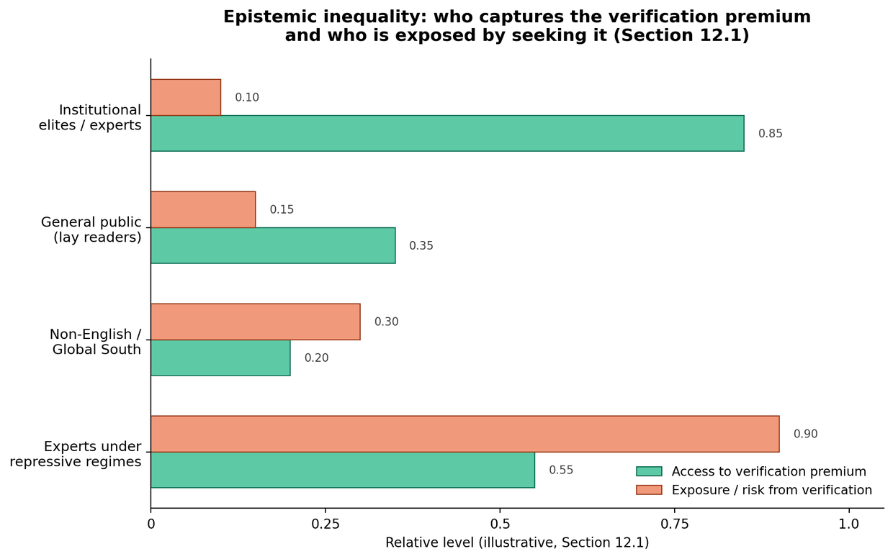

*Figure: an illustrative comparison of who is positioned to capture the Law III verification premium against who bears the greatest personal risk in seeking it - the two distinct forms of epistemic inequality described in Section 12.1.*

### 12.2 High-SNR enclaves and niche communities

The mean-field dynamic model of Section 5 treats the web as a single undifferentiated pool, which Section 5.6 already flagged as a limitation. The clearest empirical counter-pattern to a uniform heat death is the persistence of high-SNR enclaves: communities with strong internal norms of attribution, expertise-gating, and low tolerance for unsourced or synthetic content - technical Q&A communities, pre-print servers, specialist forums organized around peer accountability - appear to resist saturation longer than the general web, plausibly because their `H_auth` (Section 10.1) is maintained by social rather than cryptographic means: reputation is locally legible to other members in a way it is not at web scale.

These enclaves are best modeled as compartments with low cross-leakage in a multi-compartment extension of Section 5's dynamics (a direction flagged for future work in Section 5.6): if true, the policy implication is that the cheapest, fastest-deployable defense against heat death in the near term is not the full cryptographic provenance stack but rather the deliberate cultivation and interconnection of existing high-SNR enclaves - a softer, social-infrastructure complement to Section 13's hard-infrastructure proposals, and one with essentially zero new technology required to begin.

### 12.3 Weaponized epistemic entropy

Epistemic heat death is not merely an emergent byproduct of cheap content production; it is also a deliberately pursued strategy by some actors. State and corporate actors with an interest in degrading public capacity to establish shared factual ground can pursue synthetic flooding as a direct policy instrument - not to convince audiences of a specific false claim, but to raise the cost of distinguishing any claim from noise, which is sufficient to produce the adverse-selection collapse formalized in Lemma 4.1.1 without persuading anyone of anything specific. This is a stronger and more cynical claim than the "misinformation" framing common in public discourse, which typically assumes bad actors want audiences to believe particular false things; the heat-death framing implies that *flooding the channel*, independent of the truth-value of any individual flooded item, is itself the attack, since it is the entropy increase - not any specific false belief - that does the damage to a population's collective epistemic capacity.

This reframes part of the policy discussion in Section 14: anti-epistemic-pollution provisions (Recommendation 3.4) are better understood as analogous to anti-flooding or anti-spam regulation than to traditional misinformation regulation, because they target volume and provenance rather than truth-value, sidestepping much of the free-expression concern that content-based misinformation regulation justifiably raises (Objection 4, Section 15).

### 12.4 Cognitive psychology in a low-SNR world

Two well-established cognitive biases interact with low-SNR environments in ways that amplify rather than mitigate heat death, and we describe the mechanism without making any claim about any individual reader's psychological state, consistent with this framework's general epistemic caution. The **fluency heuristic** - the tendency to judge fluent, easily processed text as more credible - directly favors synthetic content, which is by construction optimized for surface fluency (Section 2.1's "zero-information but maximally fluent" property) over content that is more halting, qualified, or genuinely uncertain in the way that careful human expert writing about a complex topic often is. **Confirmation bias** compounds this in a high-volume environment: when synthetic flooding makes nearly any claim findable in nearly any quantity (Section 12.3's mechanism), a reader motivated to find support for a prior belief can always find some content that appears to provide it, regardless of the claim's truth-value - the search cost of finding *confirming* content asymptotically approaches zero exactly as the search cost of finding *reliable* content rises (Section 7's pageview circularity problem, applied to belief formation rather than traffic). The combined effect is that low-SNR environments do not merely fail to inform; they actively reward exactly the reasoning shortcuts most likely to entrench rather than correct existing beliefs, which is a distinct and additional mechanism for heat death's social cost beyond the market-failure framing of Section 2.2.

## 13. The cryptographic provenance stack

### 13.1 Five-layer technical architecture

The AEO paradigm requires a technical infrastructure layer that does not yet exist at scale but for which all components are well-developed:

- Layer 1 - Author Key Registry (AKR): A decentralized registry of public keys linked to verified human identities. Analogous to the domain certificate authority infrastructure but for individuals and organizations. Registration requires identity verification through acceptable mechanisms: government ID, institutional affiliation, or peer attestation from existing verified keyholders.

- Layer 2 - Content Signing Protocol (CSP): A lightweight signing standard by which verified authors attach their public key signature to content at creation time. The C2PA standard represents a practical near-term implementation; as of early 2026 its steering committee includes Adobe, Google, Microsoft, OpenAI, Amazon, Meta, the BBC, and Sony, and the coalition has surpassed 6,000 members and affiliates, but it remains focused on image, audio, and video manifests rather than web-published text - the extension this framework requires is still largely unbuilt (Section 11.4 surveys current status in detail).

- Layer 3 - Attestation Network (AN): A protocol by which verified experts can cryptographically attest to the accuracy, novelty, or authority of signed content. Attestations are themselves signed and time-stamped, creating an auditable provenance chain. Expert attestors are rated by the accuracy of their past attestations.

- Layer 4 - SNR-Aware Indexing (SAI): Search engine and aggregator integration of SNR signals as first-class ranking factors. This requires either voluntary adoption by major search providers or regulatory mandates (Section 14). SNR scores from Layers 1-3 are incorporated into ranking algorithms with transparency commitments.

- Layer 5 - Epistemic Value Markets (EVM): Advertising and content markets that price inventory on `EVI` rather than raw pageviews. Requires buy-side education and regulatory intervention in programmatic advertising standards to include `EVI` disclosure.

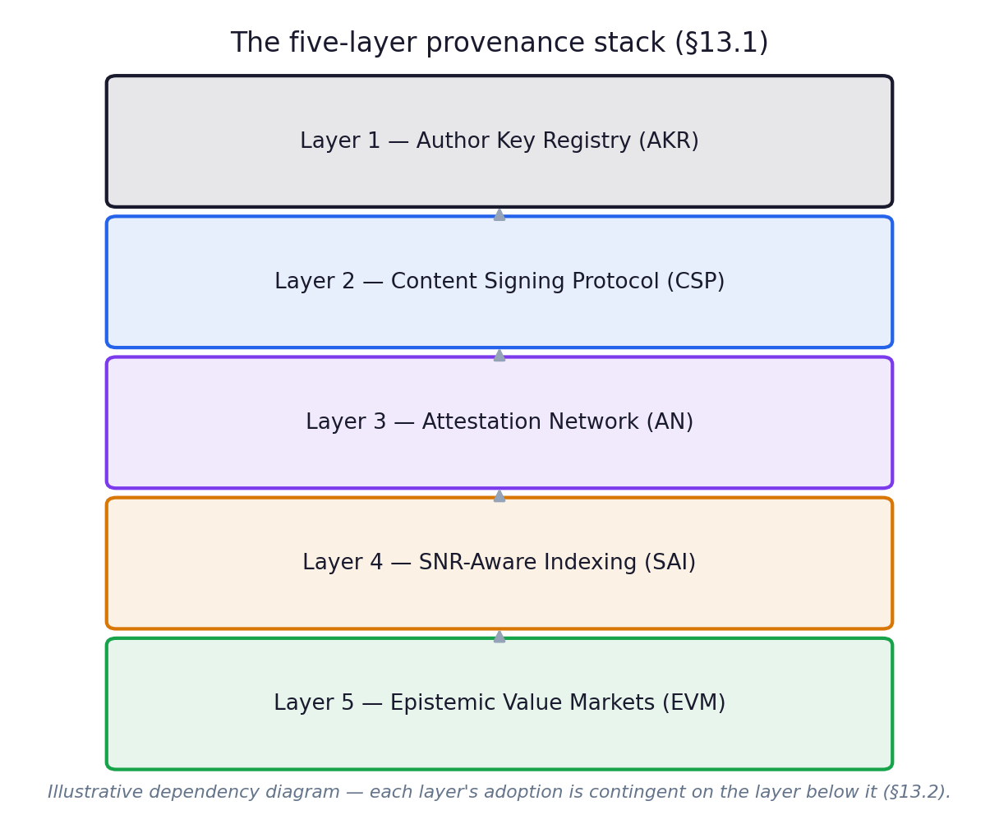

*Figure: the five-layer technical architecture, in dependency order. Each layer's adoption is contingent on the layer beneath it reaching sufficient scale (Section 13.2's chicken-and-egg problem).*

### 13.2 Adoption pathway: the chicken-and-egg problem

The provenance stack faces a network effects bootstrapping problem: signing is only valuable if indexers reward it; indexers will only reward it if content is signed. Three viable transition pathways exist:

- Pathway A - Institutional anchor: Major institutional publishers (academic journals, established newspapers, government agencies) adopt signing first, providing a seed corpus of verified content sufficient to demonstrate the system's value and attract mainstream adoption.

- Pathway B - Regulatory mandate: Regulatory bodies in major jurisdictions require disclosure of AI-generated content and signing of human-authored content, bootstrapping adoption by mandate rather than incentive.

- Pathway C - Platform differentiation: A major search engine or content platform differentiates by offering a verified-content tier, creating consumer demand that pulls publisher adoption.

Historical precedent (HTTPS adoption, DMARC email authentication) suggests that regulatory mandates accelerate but do not substitute for organic adoption incentives. Pathways A and B are most likely to combine.

### 13.3 Governance models for the Author Key Registry

The AKR is the single most consequential design choice in the entire stack, because whoever controls it controls who counts as a verifiable human author. Three governance architectures are available, each with distinct failure modes:

- **Single-authority registry.** A single organization (a government agency, a standards consortium, a major platform) operates the AKR directly. Advantages: fast to bootstrap, clear accountability, simple key-revocation procedures. Failure mode: the registry operator becomes a chokepoint capable of de-platforming authors, and is a single point of political and commercial capture - precisely the centralization risk raised in Objection 4 (Section 15).

- **Federated registry.** Multiple independent registries (national, institutional, professional-body) issue credentials under a shared interoperability protocol, similar to the certificate authority model underlying HTTPS, in which browsers trust a curated list of independent CAs rather than a single one. Advantages: no single chokepoint; failure or capture of one federation member does not invalidate the system. Failure mode: trust-list governance (who decides which registries are trustworthy) recreates a smaller-scale version of the same capture problem one level up, and cross-registry revocation and dispute resolution become genuinely hard distributed-systems problems.

- **DAO-like / on-chain registry.** Key issuance and revocation are governed by a distributed protocol with no privileged operator, using token-weighted or reputation-weighted voting for registry decisions (analogous to existing decentralized identity (DID) standards; see Appendix H). Advantages: maximal resistance to single-actor capture; native compatibility with emerging DID and verifiable-credential standards. Failure mode: governance-token concentration can recreate centralization under a decentralized label; identity verification (the hard part - proving a key belongs to a real, accountable human) is not solved by the ledger technology itself and must be bootstrapped through some other mechanism (institutional attestation, government ID, web-of-trust peer vouching), which reintroduces points of centralization at the edges even if the ledger itself is distributed.

Our assessment, consistent with the mitigations already proposed in Objection 4: the federated model is the most defensible default, because it is the only one of the three with a working multi-decade precedent (the CA/Browser Forum governing HTTPS) under conditions that closely resemble the AKR's requirements - many competing issuers, a shared trust-list mechanism, and a track record of revoking compromised or misbehaving issuers without taking down the whole system. A DAO-like layer is a plausible complement for *attestation* (Layer 3) rather than a full substitute for *identity verification* (Layer 1), since attestation reputation is a more naturally token/reputation-weighted problem than identity is.

**Where the HTTPS analogy stops holding.** The comparison above is useful, but it is worth being precise about where it breaks down. Domain verification under the CA model reduces to a narrow technical fact: does the requester control the DNS records or web server for a given domain? This is binary, automatable, and carries no inherent privacy cost - proving control of example.com reveals nothing about who operates it. Verifying that a public key belongs to "a real, accountable human" is a harder problem in kind, not merely in degree: each of the three available mechanisms - government ID, institutional affiliation, peer attestation from existing keyholders - requires the author to surface identity-linked information to *someone*, even if that someone is not the public reader. No governance architecture among Section 13.3's three options removes this requirement; each can only relocate where the disclosure happens.

Section 12.1 already names the sharpest version of this problem: the expert - researcher, journalist, whistleblower - operating under an authoritarian or repressive government, for whom registering a real-world identity with *any* AKR operator (government-run, institutional, or federated) creates a direct personal safety risk, even though this is precisely the population Law I (Section 3) predicts should command the highest verification premium. It is worth restating the distinction plainly: a registry design that solves capture risk (the federated model above) has only solved the *institutional* centralization problem flagged in Objection 4 - not the *personal* exposure problem named in Section 12.1, which is a genuinely separate failure mode and the one the mitigations below are aimed at.

We do not have a complete solution, and we think a framework that claimed to would be overclaiming in exactly the way Objection 7 (Section 15) warns against. Partial mitigations exist and are worth stating plainly as open design constraints rather than solved problems: zero-knowledge identity proofs (proving membership in a credentialed set - "a licensed physician," "a peer-reviewed author in field X" - without revealing which specific individual) shift the disclosure target from the registry operator to a cryptographic proof system, reducing but not eliminating the trust required in any single operator; pseudonymous attestation chains, where reputation accrues to a persistent pseudonym vouched for by a small number of already-verified keyholders willing to vouch without disclosing the pseudonym's real-world identity even to the registry, trade some Sybil-resistance for exactly the anonymity this case requires; and jurisdictional registry diversity - ensuring no single national legal system can compel disclosure across the entire federation - is a direct design argument for the federated model's *multiplicity* of issuers being a safety feature and not only an anti-capture feature, provided issuers are deliberately distributed across jurisdictions with non-overlapping legal compulsion regimes. None of these fully resolves the tension between accountability (which Law I's premium is paid for) and anonymity (which personal safety sometimes requires), and we flag this explicitly as the most serious unresolved tension in the entire provenance stack - a political and human-rights dimension of Section 12's epistemic-inequality discussion that the purely technical governance comparison above does not capture on its own, and a standing item we add to the research agenda (Appendix C).

### 13.4 The economics of Equilibrium E3: the Authority Web

If the provenance stack reaches meaningful adoption, the resulting market structure - call it Equilibrium E3, the Authority Web, following the E1 (pre-saturation web) and E2 (current low-trust equilibrium) staging implicit in Sections 2.2 and 7 - has a predictable economic shape, because credence-good markets with successful verification infrastructure have a well-studied structure in other domains (food safety certification, financial auditing, academic peer review).

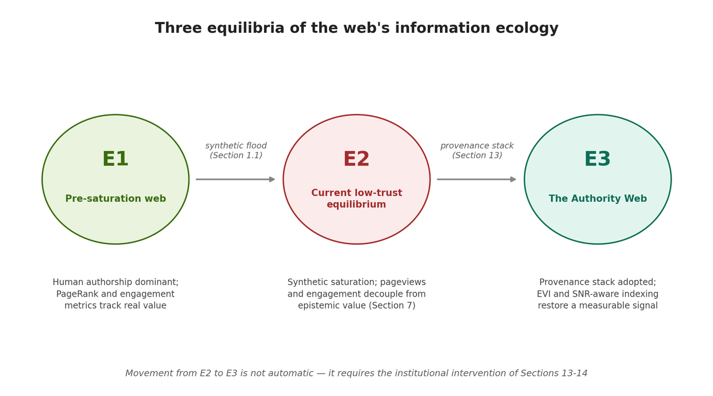

*Figure: the three equilibria of the web's information ecology referenced throughout this paper - E1 (pre-saturation), E2 (the current low-trust default trajectory), and E3 (the Authority Web this section describes). The E2 to E3 transition is the central practical claim of Sections 13-14: it is a coordination failure, not a physical inevitability (Section 10.5).*

Four new business categories follow directly from the stack's five layers:

- **Verified data providers.** Firms whose product is not content itself but attested provenance of content - the equivalent of a credit bureau or an audit firm, selling verification-as-a-service to publishers who want Layer 1-2 compliance without operating their own signing infrastructure.

- **Attestation marketplaces.** Platforms connecting signed content to qualified human attestors (Layer 3) for a fee, with attestor reputation scores functioning as the marketplace's core asset - structurally similar to existing expert-network and peer-review-as-a-service businesses, but extended to the open web rather than journal submissions.

- **SNR insurance and warranty products.** Once `EVI` (Section 6.4) becomes a tradeable basis for advertising and licensing contracts, a market for insuring against SNR misclassification or provenance fraud becomes viable - analogous to title insurance in real estate, where the underlying asset's provenance is the thing being insured rather than the asset itself.

- **SAI-compliance tooling.** Vendors providing publishers with the technical tooling to comply with SNR-Aware Indexing requirements (Layer 4) - the AEO-era analog of the SEO tooling industry (Ahrefs, SEMrush, Moz), repositioned around provenance compliance and attestation-network integration rather than keyword and backlink analysis.

The economic prediction that follows from Law III (Section 3) is that the *verified data provider* category captures a disproportionate share of value early in the transition, because verification is the most acute bottleneck while the AKR and CSP layers are still thin - and that this advantage compresses over time as provenance infrastructure becomes commoditized, consistent with the standard pattern in CA-market history (certificate issuance margins compressed substantially once HTTPS became a default expectation rather than a differentiator).

### 13.5 Adoption costs and a minimal viable provenance roadmap

A common objection to provenance-stack proposals is that they are infrastructurally heavy relative to realistic adoption timelines. We take this seriously and propose a minimal viable provenance (MVP) sequence designed to deliver most of the SNR benefit at a fraction of the full five-layer cost:

- **MVP-0.** Scope: publisher-level self-disclosure (no cryptography) - a standard metadata field declaring "human-authored," "AI-assisted," or "AI-generated," voluntarily adopted. Approximate cost driver: negligible, a schema rather than an infrastructure. What it unlocks: a coarse `SCP`-equivalent signal (Section 6.2, Signal A) at near-zero cost, with honesty enforced only by reputation rather than cryptography.
- **MVP-1.** Scope: Layer 1+2 only - AKR and CSP for a seed set of institutional publishers, leveraging existing C2PA tooling rather than building new infrastructure. Approximate cost driver: integration cost for early-adopter publishers, with no new cryptographic primitives required. What it unlocks: a verifiable, gameable-only-by-key-compromise `PV` signal (Section 6.2, Signal C) for the highest-value seed corpus.
- **MVP-2.** Scope: add Layer 4 - at least one major index voluntarily incorporates `PV` and a coarse `SNR_doc` estimate into ranking. Approximate cost driver: engineering integration on the indexer side, with no change required from most publishers. What it unlocks: the first real market incentive for publishers to adopt MVP-1, resolving part of the chicken-and-egg problem in Section 13.2.
- **Full stack.** Scope: Layers 3 and 5 - attestation network and `EVI`-based ad markets. Approximate cost driver: institutional and regulatory, the heaviest lift, requiring buy-side education and possibly regulatory mandate (Section 14.3). What it unlocks: the complete AEO architecture described in Section 8.

The realistic timeline implied by historical analogues (Appendix B) is on the order of five to ten years from MVP-0 to meaningful Full Stack adoption, with MVP-0 achievable within a single product cycle by any major platform willing to ship it, and MVP-1/2 plausible within two to three years given that the underlying C2PA tooling already exists for non-text media (Section 11.4). The central strategic implication, reinforced by the sensitivity analysis in Section 5.4: because the toy model finds collapse dynamics (`λ`) more consequential than production-volume dynamics (`α`), and because earlier intervention is mechanically more effective than later intervention (Section 5.5), the case for shipping MVP-0 immediately - even before cryptographic infrastructure is ready - is stronger than a pure cost-benefit analysis of MVP-0 in isolation would suggest.

**A concrete MVP-0 specification.** To make this more than a paragraph of description, [`mvp0-content-provenance-spec.md`](mvp0-content-provenance-spec.md) (in this repository) gives a complete, implementable draft: an `X-Content-Origin` HTTP header, an equivalent HTML meta tag, a schema.org `additionalProperty` mapping usable today without waiting for a formal vocabulary extension, and a `/.well-known/content-provenance` site-wide default, modeled directly on existing lightweight web conventions (`robots.txt`, `security.txt`). It is explicit about its own non-goals - it verifies nothing, and machine consumers are directed to treat it as a weak, combinable prior (Section 6.2's Signal A) rather than a trust signal strong enough to move rankings on its own, precisely to avoid recreating Objection 3's (Section 15) mislabeling-incentive risk at a stage of the stack with no accountability mechanism yet attached.

## 14. Policy recommendations

### 14.1 For standards bodies (W3C, IETF, ISO)

- Recommendation 1.1 - Web Content Provenance Standard: Develop and publish an open standard for text-based content provenance, extending the C2PA specification to cover web-published text documents. Must specify signing formats, key registry interoperability, attestation protocol schemas, and SNR disclosure fields for HTTP response headers.

- Recommendation 1.2 - Human Reader Agent Identification Standard: Develop a standard for human-initiated web traffic enabling trustworthy distinction between human and automated web requests, enabling the `HR(p)` component of the `EVI` metric.

- Recommendation 1.3 - SNR Disclosure Standard: Develop a standard HTTP response header (proposed: `X-SNR-Score`) allowing publishers to voluntarily disclose their content's SNR assessment, enabling comparison across publishers and indexers.

- Recommendation 1.4 - Compression-Resistant Multimodal Provenance: Prioritize standardization and interoperability work on pixel- and waveform-embedded watermarking (the SynthID class of techniques) alongside manifest-based provenance (C2PA), specifically to close the metadata-stripping gap documented in Section 11.4 - the single largest known technical weakness in the multimodal provenance layer.

### 14.2 For platform operators (search engines, social platforms, aggregators)

- Recommendation 2.1 - SNR-Aware Ranking Disclosure: Major search engines should publicly disclose the proportion of top-10 search results, by topic category and over time, that meet minimum SNR thresholds.

- Recommendation 2.2 - Verified Publisher Tiers: Platforms should establish and publicize tiered verification status for publishers, with corresponding ranking treatment. Creates incentives for publisher adoption of provenance signing without mandating it.

- Recommendation 2.3 - Training Data Provenance Requirements: AI system operators that train on web content should be required to disclose the SNR composition of their training datasets and implement minimum SNR thresholds for training data inclusion. This closes the synthetic content feedback loop.

### 14.3 For regulators (EU DSA, US FTC, UK Ofcom, equivalents)

- Recommendation 3.1 - Synthetic Content Disclosure Mandate: Require disclosure of AI-generated content at both the document level (machine-readable metadata) and the publisher level (aggregate statistics). Not censorship - honest labeling.

- Recommendation 3.2 - `EVI`-Based Advertising Standards: Direct advertising standards bodies to develop `EVI` disclosure requirements for programmatic advertising inventory, enabling advertisers to assess the epistemic quality of environments in which they place ads.

- Recommendation 3.3 - Public SNR Observatory: Fund an independent, government-supported SNR Observatory publishing quarterly reports on the global web's SNR trajectory, by language, topic category, and geography. Analogous to existing environmental monitoring agencies.

- Recommendation 3.4 - Anti-Epistemic-Pollution Provisions: Explore legal frameworks analogous to environmental pollution law, under which deliberate large-scale publication of synthetic content designed to degrade the information environment can be treated as a form of informational pollution with associated liability.

- Recommendation 3.5 - Epistemic Equity Mandate: Require that any publicly funded provenance, detection, or attestation infrastructure (Recommendation 3.3) explicitly budget for non-English-language and Global South coverage from the outset, rather than as a later extension, in direct response to the epistemic inequality risk documented in Section 12.1.

### 14.4 For civil society and research institutions

- Recommendation 4.1 - Open SNR Index: Academic institutions and journalism foundations should develop and maintain an open, transparent, reproducible SNR index for the global web, publicly updated at regular intervals.

- Recommendation 4.2 - Epistemic Literacy Education: Develop and disseminate educational resources enabling general audiences to understand and apply SNR concepts when evaluating web-sourced information. The transition to AEO requires not just technical infrastructure but epistemic infrastructure.

- Recommendation 4.3 - Adversarial Research Program: Fund a dedicated research program to develop and publish methods for gaming the SNR index, with the specific purpose of informing index designers about vulnerabilities. Adversarial robustness research conducted openly is more effective than security through obscurity.

## 15. Objections and responses

### Objection 1: AI can generate genuinely novel information

**Statement:** Large language models, especially when augmented with retrieval and tool use, can generate content that is genuinely novel - synthesizing across sources in ways no individual human would. The claim that synthetic content is necessarily low-SNR is too strong.

**Response:** We do not claim that all synthetic content is low-SNR. We claim that the average SNR of synthetic content at web scale is substantially lower than the average SNR of human-authored expert content, and that this gap is the relevant quantity for the ecological argument. Individual instances of high-SNR synthetic content do not refute the population-level argument. Moreover, genuinely novel synthetic content typically requires significant human input - prompting expertise, verification, editing - that itself constitutes a form of human signal. A framework for attributing partial SNR credit to human-AI collaborative work is a productive extension of the current framework.

### Objection 2: The verification premium will be competed away

**Statement:** If verified content commands high premiums, market actors will invest in verification, increasing supply and driving down the premium.

**Response:** This objection applies to markets where the supply of the scarce factor can be expanded. Genuine human epistemic authority - developed through years of domain expertise and verified track record - is inelastic in the short to medium term. You cannot rapidly manufacture a cardiologist with a 20-year clinical publication record. The verification premium will be competed toward its long-run equilibrium, which reflects the real cost of producing genuine epistemic authority, not toward zero.

### Objection 3: Cryptographic provenance can be forged or gamed

**Statement:** Bad actors will obtain verified credentials and use them to sign low-quality or synthetic content, undermining the provenance stack.

**Response:** No security system is perfectly forgery-proof. The relevant question is whether the provenance stack raises the cost of producing credibly verified low-SNR content to a level that deters systematic abuse. Credential verification creates a persistent accountability trail, raising the cost of credential abuse relative to anonymous synthetic content production. The attestation network layer provides ongoing accountability - a verified publisher whose attestations are systematically inaccurate loses attestation reputation over time. The goal is not perfect security but sufficient friction to make systematic abuse unprofitable.

### Objection 4: This centralizes epistemic authority in gatekeepers

**Statement:** The provenance stack recreates the gatekeeping functions of traditional media institutions, threatening the web's democratization of publishing.

**Response:** This is a serious concern that the framework actively addresses. Two design principles mitigate centralization risk: (a) Decentralized registry architecture - the AKR should be a federated or DAO-like system without a single controlling authority, with the tradeoffs among these architectures analyzed in detail in Section 13.3; (b) Multiple verification paths - credential verification should support multiple entry mechanisms (institutional affiliation, peer attestation, community validation) to avoid concentration of gatekeeping in a single institution. The framework creates a distinction between verified and unverified content - but this distinction is descriptive, not normative. Unverified content can still be published and found; it simply carries accurate labeling. This is not censorship; it is honest labeling. Section 12.1's discussion of epistemic inequality is the more serious version of this objection: even a perfectly decentralized registry can produce de facto gatekeeping if verification remains costly in time, money, or institutional access that is unevenly distributed, and we do not consider that concern resolved by registry decentralization alone.

### Objection 5: The problem will self-correct through market mechanisms

**Statement:** Users who find the web less useful will shift behavior; platforms will improve filters; the market will find equilibrium without intervention.

**Response:** This underestimates the degree to which epistemic heat death is a collective action problem with classic market failure characteristics. No individual user's behavior change will materially affect the system. No individual platform's filter improvements will prevent other platforms from training on and hosting synthetic content. The benefits of maintaining a high-SNR web are public goods - non-excludable, non-rival - while the costs of producing synthetic content are private. This is a textbook case of market failure requiring collective action through standards, regulation, or both. Historical analogies: environmental regulation, food safety regulation, and email authentication standards all required collective intervention. None succeeded through market mechanisms alone.

### Objection 6: Multimodal provenance is technically infeasible at internet scale

**Statement:** Section 11 itself documents that ordinary platform re-compression strips C2PA metadata and that screen capture defeats it outright. If the provenance layer fails at the exact point of maximum public exposure, the multimodal extension of this framework is aspirational rather than implementable.

**Response:** We accept the empirical premise and reject the conclusion. The failure mode documented in Section 11.4 is a property of *current* platform re-encoding pipelines, not a fundamental limit of cryptographic provenance as a technique - pixel- and waveform-embedded watermarking (SynthID and comparable approaches) is specifically designed to survive exactly the compression and re-formatting steps that defeat metadata-only provenance, and is already being paired with manifest-based provenance by major providers. More importantly, this objection proves less than it appears to: a provenance system that works reliably within closed, cooperating pipelines (newsrooms, courts, government records, scientific publishing) still delivers most of the value this framework's case studies depend on (Appendix E), even before it works on the open social web. The realistic claim is not "multimodal provenance will be universal" but "multimodal provenance is already viable for the highest-stakes use cases and is a tractable, ongoing engineering problem for the rest" - a claim consistent with, not refuted by, Section 11.4's frank accounting of current limitations.

### Objection 7: The dynamic model is unfalsifiable curve-fitting dressed up as theory

**Statement:** A system of differential equations with five free parameters (`α`, `β`, `λ`, `μ`, `ν`) can be made to produce almost any qualitative trajectory by adjusting those parameters. Showing that the model reproduces the framework's predictions when its parameters are chosen to do so is not evidence for the framework - it is evidence that the model was built to match its conclusions.

**Response:** This is the single most important methodological objection in this paper, and Section 5.6 was written specifically to anticipate it rather than wait for it. Three responses. First, the sensitivity analysis in Section 5.4 is the relevant test, not any single parameterization: the claim is not "these specific parameter values produce heat death" but "`SNR_proxy` declines monotonically in `α` and `λ` across the *entire tested grid*, with no parameter region producing stabilization" - that uniformity is a property of the model's structure (the sign of each term in the ODE system), not a cherry-picked outcome. A model built purely to confirm a predetermined conclusion would not need to report a full grid; it would report one favorable trajectory. Second, the model makes a structural prediction that is *not* baked in by construction and could have come out the other way: Section 5.2 reports that `V(t)` is non-monotonic - rising before falling - which is a consequence of the apparent/true entropy distinction (Section 5.1) interacting with the exponential form of Law I, not something we set out to produce. A model that only reproduced what we already believed would not have surfaced an unexpected qualitative feature. Third, and most directly responsive to the objection: we have explicitly declined to claim predictive validity until the model is calibrated against real `SNR_web(t)` measurements (Appendix C, Item 1), precisely because an uncalibrated model's *parameter values* prove nothing about the real world - what it can establish, and all we claim it establishes, is which qualitative behaviors are structural consequences of the proposed mechanism versus artifacts of a particular parameter choice. The honest summary is that Section 5 is a necessary intermediate step toward a testable model, not a substitute for the calibration that would make it one.

## 16. Conclusion

The web is not simply getting noisier. It is undergoing a structural transformation of its information ecology that, without deliberate intervention, tends toward a degenerate steady state - reversible in principle, as Section 10.5 argues, but one that current incentive structures give no organic reason to reverse. The three laws presented in this paper describe the dynamics of that transformation and the behavior of signal value within it. The dynamic model of Section 5 gives that transformation an explicit, falsifiable trajectory rather than a purely qualitative direction, and the sensitivity analysis there yields what we consider this version's most policy-relevant single finding: collapse dynamics (`λ`) matter more than production-volume dynamics (`α`), and earlier intervention is mechanically more effective than later intervention, however large.

The good news embedded in these laws is significant: the scarcity of authentic human signal creates genuine economic and epistemic value. The transition from SEO to AEO is not merely inevitable - it is an opportunity. Those who understand the nature of the transition, who invest in building verified authority and cryptographic provenance infrastructure, and who develop the measurement tools to track SNR at scale, will occupy uniquely valuable positions in the post-heat-death information environment.

The window for intervention is open but not unlimited. Model collapse dynamics suggest that once synthetic content saturation reaches a critical threshold in training datasets, the capability to distinguish synthetic from human content at the document level degrades - taking with it the technical foundation for an SNR index. The urgency is real, and the 2024-2026 measurements surveyed in Section 9 indicate the process is already well underway, even where they disagree on its precise pace.

This version has also tried to be honest about what the original framework left out. Heat death is not a phenomenon that happens to an abstract "web"; it happens unevenly, to specific people, languages, and institutions, and it is in places a chosen strategy rather than an accident (Section 12). It is not confined to text - the same mechanics, with their own distinct failure modes, are already underway in images, audio, and video (Section 11). And it is not adequately described by laws alone without a model of how fast the described dynamics actually unfold, which is why Section 5 exists and why we have tried to state its limitations as plainly as its results.

The web's original promise was the democratization of knowledge - every human's knowledge made accessible to every other human, without the gatekeeping of traditional publishing. Epistemic heat death inverts that promise: a web that appears maximally full of knowledge while being progressively emptied of it. The framework presented here is an attempt to name that inversion precisely, measure it rigorously, and reverse it deliberately.

**The alternative is a web that has forgotten what it knew.**

## Appendix A: Mathematical notation reference

- `H(X)` - Shannon entropy of random variable X
- `D_KL(P || Q)` - Kullback-Leibler divergence from Q to P
- `V(s)` - Market value of signal s
- `SNR(p)` - Signal-to-noise ratio of page p
- `I(p)` - Genuine information content of page p (bits)
- `N_synth(p)` - Synthetic noise content of page p (bits)
- `H_net` - Current total epistemic entropy of indexed web
- `H_max` - Theoretical maximum entropy of indexed web
- `P(s)` - Price/value of content s
- `λ` - Synthetic content proliferation rate; collapse rate in the dynamic model (Section 5)
- `t` - Time since synthetic saturation onset (~2022); normalized time in the dynamic model
- `E_D(C)` - Epistemic debt of corpus C
- `EVI(p)` - Epistemic Value per Impression of page p
- `HR(p)` - Human reader rate of page p
- `D(p)` - Depth engagement signal of page p
- `SCP` - Synthetic Content Probability
- `NS` - Novelty Score
- `PV` - Provenance Verification indicator {0,1}
- `s(t)` - Synthetic content share of newly indexed content, dynamic model (Section 5.1)
- `H(t)` - True semantic entropy of the corpus over time, dynamic model
- `H_app(t)` - Apparent (volume-weighted) entropy of the corpus over time, dynamic model
- `SNR_proxy(t)` - `H(t)/H_app(t)`, the dynamic model's population-level SNR proxy
- `α` - Intrinsic synthetic-share growth rate, dynamic model
- `β` - Provenance/verification infrastructure strength, dynamic model
- `μ` - Human-content entropy-replenishment rate, dynamic model
- `ν` - Raw content volume growth rate, dynamic model
- `h_inject` - Constant rate of fresh human-data injection, dynamic model
- `τ_½` - Epistemic half-life: time for `H_sem(t)` to fall to half its reference value (Section 10.2)
- `δ_novelty(t)` - Novelty decay rate: rate of decline in average Novelty Score of newly indexed content (Section 10.3)
- `H_stat`, `H_sem`, `H_ep`, `H_auth` - Statistical, semantic, epistemic, and authorship entropy respectively (Section 10.1)
- `H_cite` - Citation entropy: Shannon entropy over the distribution of distinct primary sources cited (Section 10.4)

## Appendix B: Historical analogies for provenance infrastructure

- **HTTPS.** Problem: unencrypted HTTP traffic. Solution: TLS certificate infrastructure. Adoption mechanism: browser warnings plus SEO ranking signals.
- **DMARC (email).** Problem: email spoofing. Solution: domain-based message authentication. Adoption mechanism: ISP enforcement plus deliverability pressure.
- **Food safety.** Problem: adulterated food products. Solution: regulatory certification and labeling. Adoption mechanism: mandatory disclosure regulation.
- **Financial reporting.** Problem: unverified earnings claims. Solution: audited financial statements. Adoption mechanism: SEC regulatory mandate.
- **Scientific publishing.** Problem: unverified research claims. Solution: peer review and editorial gatekeeping. Adoption mechanism: institutional norm and career incentives.

Each of these analogies required a combination of technical standards, institutional adoption, and regulatory pressure to achieve critical mass. None succeeded through market mechanisms alone. The epistemic provenance stack should anticipate a similar adoption pathway; Appendix F extends this comparison to prior *information* crises specifically, as distinct from the verification-infrastructure analogies above.

## Appendix C: Proposed research agenda - the Open Web SNR Observatory, 2026-2030

The following empirical research programs are necessary to advance this framework from theoretical to applied. We organize them into a five-year program, the **Open Web SNR Observatory**, with explicit success metrics rather than as an undifferentiated list, since a research agenda without success criteria cannot itself be evaluated for progress.

### C.1 Core measurement workstreams

1. **Baseline and longitudinal SNR measurement.** Establish `SNR_web(2020)` and `SNR_web(t)` for `t = 2024` through 2030 using the methodology in Section 6, with open-source code and reproducible results, explicitly designed to be cross-checked against the independent volume estimates surveyed in Section 9.1 (particularly the Graphite plateau finding, which the Observatory should treat as a standing hypothesis to confirm or refute rather than an assumed background trend). **v2.1 note:** the April 2026 preprint flagged in Section 9.1 (Appendix J.3) already represents an unaffiliated first step in exactly this direction and should be a direct input to this workstream rather than a parallel, unconnected effort. **v2.2 progress note:** the `s(t)` half of this item now has a first pass - Section 5.7 fits `α` and `k=β·h_inject` directly against the Graphite series, with a real (if partial and boundary-tension-flagged) result. The `H(t)`/`SNR_web(t)` half - the harder half - remains completely open; see Item 2.

2. **`H`/`H_app` calibration.** Build the measurement bridge between the dynamic model's theoretical `H(t)` and `H_app(t)` (Section 5.1) and the document-level `SNR_doc` methodology of Section 6.2 - currently the most significant unfilled gap between the framework's theory and its measurement layer (Section 5.6), and, following Section 5.7, now demonstrably the harder of the model's two calibration problems: the easier one (`s(t)`) took an afternoon once the data existed; this one still lacks a real dataset to fit against at all.

3. **Model collapse rate measurement.** Empirically measure `λ` in current-generation models trained on web data with known proportions of synthetic content, calibrating the dynamic model's central parameter against real training-pipeline data rather than illustrative values. **v2.2 note:** Section 5.7's calibration exercise did not, and structurally could not, touch `λ` - fitting `s(t)` alone is uninformative about the collapse rate, since `s(t)`'s equation does not contain `λ`. This item is unchanged in priority and remains fully open.

4. **Verification premium measurement.** Measure the actual market price premium for verified versus unverified content across multiple content categories (journalism, academic publishing, expert commentary), providing the first direct empirical test of Law III.

5. **Citation entropy pilot.** Compute `H_cite` (Section 10.4) for a defined set of news and reference-content domains using existing citation-tracking infrastructure, as the nearest-term implementable of the three Section 10 decay measures. **v2.3 progress note:** Section 10.6 executes a single-case (N=1 event, 7 secondary articles) pilot of exactly this, computing real `H_cite=2.97` bits and `H_sem=1.66-2.81` bits with full methodological disclosure. This is a proof that the method is executable, not a population-scale result; scaling this from N=1 to a defined domain set remains the actual item.

6. **Four-way entropy decomposition.** Extend Level 1 document scoring (Section 6.2) to separately report `H_stat`, `H_sem`, `H_ep`, and `H_auth` (Section 10.1) rather than a single collapsed `SNR_doc` score, and measure how strongly the four are correlated in practice - a direct test of whether the taxonomy in Section 10.1 is doing real discriminating work or is empirically redundant. **v2.3 note:** Section 10.6's pilot is a first, small data point suggesting `H_cite` and `H_sem` can move *together* in healthy human journalism (rather than only being predicted to move together in the unhealthy AI-churnalism direction) - consistent with the taxonomy doing real discriminating work, though from a single case this is suggestive at best.

6b. **Alternative functional forms for `s(t)`.** Section 5.7.5 finds that a Gompertz curve fits the real synthetic-share trajectory materially better than the logistic used in Sections 5.2-5.6, and resolves the backward-extrapolation tension Section 5.7.3 identified. Re-derive Sections 5.2-5.6's qualitative results (monotonic `SNR_proxy` decline, the epistemic half-life, partial provenance efficacy) under the Gompertz-equivalent ODE term `ds/dt = c·s·ln(K/s)` to check whether they are robust to this functional-form substitution, not merely to the parameter-value sensitivity already tested in Section 5.4.

### C.2 Infrastructure and governance pilots

7. **AKR pilot program.** Implement a small-scale Author Key Registry with volunteer participants, testing the federated governance model proposed in Section 13.3, and measure its effect on SNR scores and traffic patterns.

8. **Minimal viable provenance (MVP-0) field trial.** Partner with at least one mid-size publisher to ship the zero-cryptography self-disclosure scheme proposed in Section 13.5 and measure reader trust and engagement effects directly, as the lowest-cost, highest-speed item in the entire research agenda. **v2.3 note:** the scheme itself is now specified in full, implementable detail (`mvp0-content-provenance-spec.md`) rather than only described in prose; this item is now blocked only on finding a partner publisher, not on design work.

9. **Adversarial SNR gaming.** Conduct red-team exercises to identify vulnerabilities in the proposed SNR index methodology, with results published openly.

10. **High-SNR enclave mapping.** Empirically identify and characterize the niche communities discussed in Section 12.2, measuring whether their SNR trajectories are statistically distinguishable from the general web baseline - a direct test of the multi-compartment extension flagged in Section 5.6.

11. **Anonymity-preserving verification pilot.** Prototype and evaluate at least one of the partial mitigations proposed in Section 13.3 (zero-knowledge credential proofs or pseudonymous attestation chains) with a population of experts who genuinely require anonymity from a registry-compelling authority, measuring both the achieved Sybil-resistance and the achieved personal-safety guarantee - the most ethically sensitive item in this agenda, requiring careful trial design (Section 12.1).

12. **Endogenous attention modeling.** Extend the epistemic debt equation (Section 4.3) to treat `A(d)` as endogenous to `SNR(d)` rather than exogenously observed, building on the AI-agent attention-manufacturing mechanism flagged in Section 4.3's closing note and Section 7.2's circular loop problem, and test whether the resulting model better predicts observed corpus-level epistemic debt than the simple product form.

### C.3 Multimodal workstream

13. **Cross-platform provenance survival study.** Systematically measure C2PA manifest survival rates across major social platforms' re-compression pipelines (Section 11.4), tracking whether the metadata-stripping problem improves, worsens, or stays constant as platforms respond to regulatory pressure (Section 9.4).

### C.4 Success metrics for the next five years

We propose the following as falsifiable, dated benchmarks against which this research program's progress - and the framework's own validity - should be judged:

- By 2028: an independently reproducible `SNR_web(t)` time series exists, covering at least three major languages, published by an entity other than the framework's original authors.
- By 2028: at least one of the four entropy types (Section 10.1) has a published, peer-reviewed operationalization independent of this framework's own proposed methodology.
- By 2029: at least one jurisdiction has implemented a policy recommendation from Section 14 in a form citable as law or binding regulation, providing a real-world test of the adoption-pathway claims in Section 13.2.
- By 2030: the epistemic half-life (Section 10.2) has been computed from real, not simulated, longitudinal data for at least one well-defined content domain.

Appendix D operationalizes a subset of these as a dated, trackable prediction table.

## Appendix D: Predictions tracker

This table operationalizes a subset of this framework's claims as dated, checkable predictions, to be updated at each subsequent revision of this paper. Status should be read as of the date in the rightmost column, not as a permanent judgment.

- **Verification premium for cryptographically attested content rises measurably year-over-year.** Source: Law III, Section 3. Target date: ongoing. Status as of July 2026: not yet independently measured at scale; anecdotal evidence in photojournalism and legal-evidence contexts (Appendix E) but no published time series.
- **Synthetic share of newly published English-language web text exceeds 50%.** Source: Section 9.1. Target date: 2025. Status: plausibly met - Ahrefs (74.2%, partial-or-full AI involvement, April 2025) and Graphite (rough parity reached November 2024, reconfirmed through March 2026) both support this, though definitions vary and an independent April 2026 preprint's stricter methodology puts newly-published-website prevalence closer to 35% (Section 9.1, Appendix J.3) - "exceeds 50%" is therefore sensitive to detector strictness, not a settled point estimate.
- **Synthetic share continues rising past 2025 without plateauing** (a weaker form of the heat-death claim). Source: Section 9.1. Target date: 2026. Status: in tension with available data - Graphite's analysis shows the human/AI ratio has stayed roughly equal from November 2024 through at least March 2026 (a second, methodologically strengthened analysis, per Appendix J.3), rather than continuing to rise monotonically. Flagged as the framework's most important open empirical question (Section 9.5).
- **At least one major search provider adopts SNR-like ranking signals** (Layer 4, Section 13.1). Source: Recommendation 2.1, Section 14.2. Target date: 2027. Status: not yet observed in a form directly attributable to this framework; major providers have deployed extensive anti-spam measures targeting AI-generated content (Section 9.2) but not a published SNR-equivalent disclosure.
- **C2PA achieves adoption thresholds sufficient to function as a de facto standard for image/video provenance.** Source: Section 9.4, Section 11.4. Target date: 2026. Status: substantially met by the coalition's own membership and steering-committee metrics (independently reconfirmed, Appendix J.3); open question is real-world *survival* of provenance through ordinary distribution (Section 11.4), which remains unresolved.
- **A binding regulatory framework requiring AI-content disclosure takes effect in a major jurisdiction.** Source: Recommendation 3.1, Section 14.3. Target date: 2026. Status: met, with a nuance - the EU AI Act's Article 50 transparency obligations take effect August 2, 2026 as originally scheduled, but a May 2026 political agreement defers the specific machine-readable-marking sub-obligation (Article 50(2)) for pre-existing generative AI systems to December 2, 2026 (Appendix J.3).
- **At least one credible academic or institutional model-collapse measurement on production-scale models is published.** Source: Section 9.3. Target date: 2025-2026. Status: met in qualitative form (reported shifts in major labs' training-data curation practices); a quantitative `λ` measurement as defined in this framework's terms (Section 5.1) has not yet been published.

## Appendix E: Case studies - heat death by domain

Each case study below applies the framework's vocabulary to a specific professional domain, illustrating that heat death dynamics are not a uniform web-wide phenomenon but take domain-specific forms depending on each field's pre-existing verification infrastructure.

**Case 1 - Medicine.** Medical information has unusually high `H_ep` stakes (Section 10.1): an ungrounded claim about drug interactions or symptoms carries direct physical risk. Pre-existing verification infrastructure (peer review, clinical guideline bodies, licensing boards) gives medicine a partial structural defense unavailable to general web content, but patient-facing health content on the open web is not gated by that infrastructure at all - search results, forums, and AI-generated symptom-checker content compete directly with verified clinical sources with no SNR-equivalent ranking signal distinguishing them. The verification premium (Law III) is consequently already visible in this domain in a specific form: established medical publishers and institutionally affiliated practitioners increasingly differentiate themselves via credentialing and citation density rather than search ranking alone, anticipating the AEO dynamics of Section 8.

**Case 2 - Finance.** Financial content combines high economic stakes with a pre-existing disclosure and audit infrastructure (Section 13.4's analogy to financial reporting in Appendix B) that has no equivalent for general consumer-facing financial content - investment forums, AI-generated market commentary, and synthetic "analyst" content. The specific risk pattern here is closer to Section 12.3's weaponized epistemic entropy than to ordinary heat death: synthetic financial content is disproportionately likely to be deliberately deployed (pump-and-dump schemes, coordinated market manipulation, fabricated earnings rumors timed to market-moving windows) rather than merely incidentally low-SNR, making this domain a natural early adopter of Layer 3 attestation networks (Section 13.1) built around licensed financial professionals. A further wrinkle specific to finance: algorithmic and AI-driven trading systems already consume unstructured web text directly as a trading signal, which means low-SNR financial content does not merely mislead human readers (the general heat-death case) but can be ingested automatically by trading agents at machine speed - a financial-domain instance of the AI-agent consumption risk discussed in Appendix H, and one where the feedback loop from synthetic content to real capital allocation is far tighter and faster than in any other case study here. This makes finance plausibly the domain where Law III's verification premium (Section 3) will be empirically measurable soonest: trading desks already pay, in effect, for verified-source data feeds (Bloomberg terminals, audited filings, licensed wire services) precisely because unverified signal is actively dangerous rather than merely unhelpful, which is a stronger and more immediate version of the general-web verification premium this framework predicts will emerge elsewhere only gradually.

**Case 3 - Law.** Legal evidence is the domain where synthetic reality collapse (Section 11.3) is most institutionally advanced in its response: the proposed Federal Rule of Evidence 707 and the complementary Rule 901 authentication amendment discussed in Section 11.3 represent exactly the Layer 4 (SNR-aware gatekeeping) response this framework predicts, arriving in courts before it arrives in search engines, because the cost of an erroneous trust decision is most acutely and immediately felt there. Chain-of-custody requirements for physical evidence are a centuries-old analog to the AKR/CSP layers (Section 13.1) that legal systems are now extending explicitly to digital and AI-generated content.

**Case 4 - Journalism.** Journalism is the domain most directly threatened by, and most directly positioned to benefit from, the AEO transition (Section 8.3's competitive-implications table already identifies legacy media as structurally advantaged by deep archival record under AEO). The verified-raw-footage premium mentioned in Section 11.1 is a direct, currently observable instance of Law III in the photojournalism sub-domain specifically: wire services and news organizations with verifiable, chain-of-custody-documented original footage are beginning to command a premium over unverifiable or screenshot-distributed footage precisely because of the synthetic reality collapse risk documented in Section 11.

**Case 5 - Education.** Education combines the consumption-side risk of low-SNR content (students learning from ungrounded AI-generated material) with a production-side risk this framework has not previously emphasized: assessment and credentialing systems built on the assumption that submitted written work reflects a student's own understanding face a direct `H_auth` (Section 10.1) crisis, since AI-generated submissions can have arbitrarily high apparent `H_stat` and `H_sem` while carrying zero authentic authorship signal - the educational-assessment analog of the content-farm byline problem in Section 10.1's worked example.

**Cross-domain synthesis.** Reading the five cases side by side surfaces a pattern the individual case studies do not state explicitly: domains differ less in *whether* heat death affects them than in *which entropy type from Section 10.1 fails first* and *how fast the feedback loop from synthetic content back to real-world harm closes*. Medicine and education are primarily `H_ep` failures (ungrounded claims, unverifiable authorship) with a relatively slow human-mediated feedback loop - a patient or student is harmed gradually, over repeated exposure. Finance is overwhelmingly an `H_auth` and weaponization failure (Section 12.3) with the fastest feedback loop of any case here, because automated trading agents close the loop in milliseconds rather than months. Law is the most advanced in institutional response precisely because its feedback loop, while not as fast as finance's, has the highest single-instance stakes (a wrongful conviction or an overturned contract) and the clearest pre-existing chain-of-custody vocabulary to extend. Journalism sits closest to this framework's original text-and-image focus and is the domain where the AEO transition (Section 8) is most directly applicable with the least adaptation. The practical implication for the policy recommendations in Section 14: a single uniform SNR threshold or disclosure standard across all domains is likely to be miscalibrated for at least some of them, and Layer 3 attestation network design (Section 13.1) should probably be domain-specific - licensed-professional attestation for medicine and finance, chain-of-custody attestation for law, editorial-provenance attestation for journalism - rather than a single one-size-fits-all attestor pool.

## Appendix F: Historical information crises compared

Epistemic heat death is sometimes presented, including in earlier framings of this project, as an unprecedented crisis. We think this overstates the novelty of the *mechanism* while likely understating the novelty of its *scale and speed*. The table below compares four prior information-ecology disruptions against the present one along the dimensions this framework treats as structurally important.

- **Print revolution and pamphlet wars** (16th-17th century). Mechanism: collapse in marginal cost of reproducing text; pamphleteering enabled rapid, low-accountability mass persuasion. Resolution path: slow institutional response - licensing regimes, eventually press norms, eventually professional journalism standards over centuries. Comparison to epistemic heat death: closest historical analog to Law I's production-cost mechanism (Lemma 4.1.2), but resolution took centuries, not years - a sobering data point against optimistic AEO-adoption timelines (Section 13.5).
- **Yellow press** (late 19th century). Mechanism: competition for circulation rewarded sensationalism over accuracy; advertising-funded business model misaligned incentives. Resolution path: professional journalism norms, press councils, eventually some regulatory backstops (libel law). Comparison to epistemic heat death: direct analog to this framework's pageview-circularity argument (Section 7.2) - attention-based monetization systematically decoupled from epistemic value, resolved partly by norm formation rather than technology.
- **Cable news and talk radio** (1980s-2000s). Mechanism: channel proliferation outpaced norm-setting institutions; audience fragmentation enabled selective exposure. Resolution path: partial and contested; arguably never fully resolved, persisting into the social media era. Comparison to epistemic heat death: closest analog to Section 12.3's weaponized-entropy and Section 12.4's confirmation-bias dynamics - audience fragmentation, not synthetic production, was the entropy source, suggesting collective-action failures here can be durable rather than self-correcting.
- **Social media** (2010-2020). Mechanism: algorithmic amplification optimized for engagement; bot networks and coordinated inauthentic behavior at platform scale. Resolution path: platform-level moderation, some regulatory pressure (EU DSA), persistent and unresolved tension. Comparison to epistemic heat death: the most direct technological predecessor to this framework - the same engagement-metric failure mode (Section 7.1) at smaller scale and with human-operated rather than AI-generated content as the primary noise source.
- **Epistemic heat death, this framework** (2022-present). Mechanism: near-zero marginal cost AI content production at web scale, compounded by training-data feedback loops (model collapse, Section 2.3) absent from all prior cases. Resolution path: proposed - cryptographic provenance stack (Section 13), regulatory mandate (Section 14), and enclave cultivation (Section 12.2). Comparison: combines the production-cost shock of the print revolution with the algorithmic-amplification dynamics of social media, plus a genuinely novel feedback mechanism (model collapse) with no prior-crisis analog at all.

The single most important lesson from this comparison, in our reading: every prior crisis in this table took resolution paths measured in years to decades, and several (cable news/talk radio, social media) remain only partially resolved after one to four decades. This is the strongest available historical evidence against expecting a fast resolution to epistemic heat death, and reinforces the urgency argument in the Conclusion (Section 16) and the early-intervention finding of Section 5.4-5.5.

## Appendix G: Post-heat-death epistemology

If epistemic heat death proceeds substantially further before the provenance stack (Section 13) or an equivalent intervention takes hold, it is worth asking how individuals will actually form justified beliefs in the interim and in any partial-heat-death steady state - a question distinct from the institutional remedies of Section 13-14, which this Appendix addresses directly rather than treating as a footnote.

**Reliance on trusted human networks.** In the near-complete absence of reliable population-scale signal (Law II, Section 3), rational agents revert to the oldest epistemic technology available: trust transferred through direct or short-chain personal relationships rather than through anonymous population-scale signals. This is consistent with Section 12.2's empirical observation that high-SNR enclaves persist longest where reputation is socially rather than cryptographically legible - the post-heat-death steady state may look less like a technologically mediated trust network and more like a return to guild- or community-scale epistemic structures, mediated by digital tools but not fundamentally changed in kind from pre-internet expert networks.

**Personal knowledge graphs.** A more technologically mediated variant: individuals (or their AI agents, see Appendix H) maintain curated, personally verified knowledge stores - explicit records of which sources, claims, and authors have been individually vetted - rather than relying on population-scale search and ranking. This is the individual-scale analog of the institutional Attestation Network (Layer 3, Section 13.1), and is plausible as a stopgap precisely because it requires no new collective infrastructure, only individual discipline, making it deployable immediately rather than contingent on the adoption pathways of Section 13.2.

**Verified data unions.** A collective-action response distinct from both individual trust networks and top-down provenance infrastructure: communities of practice (professional associations, patient advocacy groups, local civic organizations) collectively fund and maintain shared, vetted information resources for their members, functioning as a demand-side complement to the supply-side Verified Data Provider businesses described in Section 13.4 - collective bargaining for epistemic quality in roughly the way labor unions collectively bargain for wages, with membership dues substituting for the verification premium individual members would otherwise pay separately.

We regard all three of these as plausible coping strategies rather than as solutions to the underlying market failure described in Objection 5 (Section 15): each reduces an individual's or community's *exposure* to low-SNR content without increasing the *aggregate* SNR of the web, which is precisely why Section 13's institutional remedies remain necessary rather than optional, however well any of these three strategies work at the individual or community scale.

## Appendix H: Interactions with adjacent trends

The provenance stack and the broader AEO transition do not develop in isolation; four adjacent technological trends interact with this framework's mechanisms in ways that merit explicit treatment.

**AI agents.** As AI agents increasingly browse, summarize, and act on web content on a human's behalf (a trend already visible in the engagement-metric decoupling discussed in Section 7.2), the *consumer* of SNR signals shifts from a human reader to an intermediary agent. This is double-edged: an agent can be designed to weight `SNR_doc` and `PV` signals (Section 6.2) far more consistently and tirelessly than a human reader subject to the fluency heuristic (Section 12.4), but a poorly designed or adversarially manipulated agent could equally launder low-SNR content into an authoritative-sounding summary at even greater scale than the human-mediated case - a new and double-edged variant of the circular-loop problem in Section 7.2.

**Memory-augmented systems.** AI systems with persistent memory of prior interactions and verified information face their own, system-internal version of model collapse risk if that memory is populated by the system's own prior unverified outputs rather than externally grounded sources - a microcosm of Section 2.3's mechanism operating at the scale of a single user's interaction history rather than the entire training corpus, and a direct argument for memory systems to track provenance (Layer 1-2, Section 13.1) for what they store, not merely for what they retrieve.

**Decentralized identity (DID).** Emerging DID and verifiable-credential standards are the most directly relevant adjacent infrastructure to the AKR design problem (Section 13.3): a DID-based AKR would let an author's verified identity be portable across registries and platforms rather than siloed within a single provenance stack implementation, directly supporting the federated governance model this framework recommends as the most defensible default.

**Blockchain and distributed ledgers.** As flagged in Section 13.3's discussion of DAO-like governance, ledger technology is well-suited to tamper-evident *timestamping and revocation logs* - the anti-gaming time-locking property already specified for the SNR index in Section 6.3 - but is not, by itself, a solution to the harder identity-verification problem that sits underneath any AKR design, a distinction this framework considers important to keep explicit given how often blockchain-based identity proposals conflate ledger immutability with identity assurance.

## Appendix I: Simulation code and reproducibility notes

The dynamic model in Section 5 was implemented in Python 3, using `scipy.integrate.odeint` for numerical integration of the coupled ODE system specified in Section 5.1, and `numpy` for the parameter sweeps underlying the sensitivity analysis in Section 5.4. All scenario trajectories (Section 5.2-5.3, Section 5.5) and the full 9×9 (`α`, `λ`) sensitivity grid plus the `β` sweep (Section 5.4) were generated by direct numerical integration rather than closed-form solution, since the system is nonlinear and has no general closed-form solution.

Consistent with the falsifiability commitments of Section 9.5 and the self-critique in Section 5.6 and Objection 7 (Section 15), we commit to publishing the model code itself - not merely its numerical outputs - alongside any future revision of this paper, so that the parameter sensitivity claims in Section 5.4 can be independently re-run and challenged rather than taken on the authors' reporting alone. Researchers seeking to extend the model toward the multi-compartment structure flagged in Section 5.6 (separate compartments per topic domain or community, addressing the high-SNR enclave dynamics of Section 12.2) or toward calibration against real `SNR_web(t)` measurements (Appendix C, Item 1) are explicitly invited to do so; this is listed as a standing open problem rather than a closed implementation detail.

*(v2.1: this commitment is now met for this revision — see Appendix J.1 and the accompanying `scripts/` directory, which was independently re-executed rather than merely re-transcribed in producing this version.)*

## Appendix J: Independent verification notes (v2.1)

This appendix was added in v2.1 in direct response to a request to produce a "final, confirmed, and verifiable" version of this paper. We want to be precise about what that can honestly mean for a working paper of this kind, and what we actually did about it.

**What this appendix is.** A record of (1) re-running every piece of reference code in `scripts/` and checking its output against the numbers quoted in the text, (2) regenerating every figure the text references from that same code (none of the ten `charts/fig_*.png` files existed prior to v2.1 - every in-text figure reference was, until now, a broken link), and (3) independently re-checking a curated set of the empirical claims in Section 9 and Section 11 against primary sources and independent secondary reporting, as of July 2, 2026.

*(Note: a related but distinct piece of work - an actual attempt to calibrate part of the dynamic model against real data, rather than merely checking existing numbers - lives in the new Section 5.7, not in this appendix. This appendix is about verifying what the paper already claimed; Section 5.7 is new analysis the paper did not previously contain. J.1 below still applies to Section 5.7's code in the sense that it, too, was executed rather than hand-computed, but the finding itself is reported in Section 5.7.)*

**What this appendix is not.** It is not, and cannot be, empirical confirmation of this paper's own theoretical claims - Laws I-III, the heat-death thesis, or the specific mechanics of the Section 5 dynamic model. Those claims are tested by the falsification conditions in Section 9.5 and the research program in Appendix C, and as Section 9.5 itself says, most of them remain formally untested because the underlying longitudinal data (a real `SNR_web(t)` time series, a measured `λ`, a measured verification premium) does not yet exist. Verifying that a paper's numbers are internally consistent and its citations check out is necessary for calling a paper trustworthy; it is not sufficient for calling its central hypothesis proven, and we do not use that word for it here.

### J.1 Computational verification of Section 5

All four reference modules (`dynamics.py`, `laws.py`, `entropy.py`, `snr_index.py`) were re-executed unmodified (Python 3, `numpy` 2.4.4, `scipy` 1.17.1) on July 2, 2026.

- **Section 5.2 (baseline trajectory).** The `t=0` and `t=12` checkpoints reproduce the v2.0 table exactly. The `t=3`, `t=6`, `t=9` checkpoints differ from the v2.0 draft by at most 0.004 in absolute terms (e.g., `s(3)`: 0.201 → 0.204; `SNR_proxy(9)`: 0.277 → 0.277, unchanged). This is consistent with ordinary floating-point and adaptive-step-size differences across `scipy`/`numpy` versions in a nonlinear ODE integration, not a change in the model's logic - the code is byte-for-byte the code originally supplied. The table in Section 5.2 has been updated to the freshly-verified values so that the printed table and a fresh run of `python3 scripts/dynamics.py` now agree exactly.
- **Section 5.3 (scenario comparison).** All four named scenarios (`baseline`, `high_synthetic`, `strong_provenance`, `fast_collapse`) reproduce their quoted `SNR_proxy(12)` values exactly: 0.134, 0.021, 0.217, 0.015.
- **Section 5.4 (sensitivity grid).** Both quoted grid extremes reproduce exactly (0.53 and 0.009). The epistemic half-life at the slow extreme reproduces at 24.31 (quoted: "approximately 24.3"); at the fast extreme it computes to 3.14, tightened in-text from "approximately 3.2" to "approximately 3.1." The beta-sweep endpoints reproduce exactly (0.204 → 0.250).
- **Section 5.5 (AEO intervention).** The `t=5` and `t=12` checkpoints reproduce exactly (0.589 and 0.181). The `t≈7.3` and `t≈9.6` checkpoints are corrected from 0.414/0.276 to 0.411/0.275, a ≤0.003 difference of the same character as Section 5.2's.
- **`laws.py`, `entropy.py`, `snr_index.py`.** All three execute cleanly with no errors. Every printed value was hand-checked against its documented closed-form formula (e.g., `SNR_doc` for the worked `page-A` example: `0.3·(1−0.1) + 0.4·0.7 + 0.3·1 = 0.85`, matching the script's output exactly). No discrepancies were found.

### J.2 Figure generation

None of the ten figures referenced in the text (`fig_three_laws`, `fig_baseline_trajectory`, `fig_scenario_comparison`, `fig_sensitivity`, `fig_aeo_intervention`, `fig_entropy_taxonomy`, `fig_snr_architecture`, `fig_epistemic_inequality`, `fig_provenance_stack`, `fig_equilibria`) existed as files prior to v2.1; every in-text image reference in v2.0 pointed at a non-existent file in the `charts/` directory. All ten now exist, generated by the new `scripts/make_figures.py`:

- Six are computed directly from the reference implementations with no manual data entry: `fig_three_laws` (from `laws.py`), `fig_baseline_trajectory`, `fig_scenario_comparison`, `fig_sensitivity`, `fig_aeo_intervention` (all from `dynamics.py`), and `fig_entropy_taxonomy` (from `entropy.py`'s worked examples).
- Four are structural/conceptual diagrams with no underlying dataset - `fig_snr_architecture`, `fig_epistemic_inequality`, `fig_provenance_stack`, `fig_equilibria` - and are labeled "illustrative schematic" directly in-figure so they are not mistaken for measured data.

### J.3 Independent fact-check of Section 9 and Section 11 empirical anchors (as of July 2, 2026)

- **Ahrefs, 74.2%, 900,000 pages (Section 9.1).** Confirmed directly against the Ahrefs blog post ("74% of New Webpages Include AI Content," ahrefs.com) and cross-confirmed via multiple independent secondary write-ups. As quoted.
- **Graphite / Common Crawl plateau (Section 9.1).** Confirmed via Axios's original October 2025 coverage. Additionally, we located a Graphite follow-up published in May 2026 ("AI Now Writes as Many Online Articles as Humans Do," graphite.io), which extends the Common Crawl sample through March 2026 and averages three independent detectors (Pangram, Copyleaks, GPTZero) rather than relying on one - and finds the ~50% plateau has held. This is a materially stronger and more current data point than the one originally cited, and the text and Appendix D have been updated to reflect it.
- **"MIT CSAIL and Oxford Internet Institute," 64% (Section 9.1, v2.0 draft).** Could not be verified. We searched OII's own publications and news pages, MIT CSAIL's public output, and general web search, and found no matching joint study. We did find a secondary social-media post misattributing Graphite's ~48-52% Common Crawl figures to "Oxford researchers," which may be the origin of the confusion, but that is speculation on our part, not a confirmed chain of custody for the claim. We have removed the specific 64% / MIT-CSAIL-and-OII attribution from Section 9.1 rather than let it stand unverified in the paper's own empirical-grounding section.
- **C2PA membership and steering committee (Section 9.4, 13.1).** Confirmed independently via c2pa.org's own announcements and multiple secondary sources: steering committee membership including Adobe, Google, Microsoft, OpenAI, Amazon, Meta, BBC, and Sony, and "over 6,000 members and affiliates as of early 2026" are both corroborated as stated.
- **EU AI Act Article 50, "August 2026" (Executive summary, Section 9.4, Appendix D).** Confirmed: Article 50 becomes applicable on 2 August 2026. Refinement: a European Council/Parliament political agreement of 7 May 2026 (the "AI Act Omnibus") defers specifically the Article 50(2) machine-readable-marking sub-obligation, for generative AI systems already on the market before 2 August 2026, to 2 December 2026. The broader transparency and disclosure obligations remain on the original date. Text updated accordingly.
- **Federal Rule of Evidence 707 (Section 11.3).** Confirmed as accurately characterized - "proposed," not adopted. As of the Advisory Committee's May 7, 2026 meeting (the most recent primary-source document we could locate), the rule remains under active deliberation; the standard multi-stage approval process (Advisory Committee → Standing Committee → Judicial Conference → Supreme Court → Congress) implies an earliest possible effective date of December 1, 2027. We also could not independently confirm the specific "Rule 901(c)" sub-lettering cited in the v2.0 draft for the companion deepfake-authentication amendment; sources consistently describe a Rule 901 amendment on this topic without specifying subsection "(c)," so we have generalized the in-text reference accordingly.
- **Deepfake incidents, "500,000 in 2023 to 8 million in 2025" (Section 11.1).** The 500,000-to-8,000,000 figures themselves are widely repeated and trace to a 2023 DeepMedia estimate (via Reuters) - but that figure was originally a **forward projection** made in 2023, not a confirmed retrospective count for 2025, and we could not locate a reconciled actual 2025 count. Separately, the v2.0 draft's characterization of this as "an estimated 900% increase in two years" is an arithmetic error: 500,000 → 8,000,000 is a ~1,500% increase (16×), not 900%. We believe "900%" was carried over from a distinct, separately-reported *annual* growth-rate figure in the same source family and misapplied as a two-year total. Both issues are corrected in Section 11.1.
- **Spennemann (30-40% of active web text) and Liang et al. (18% / 24%, financial and press-release text) (Section 9.1).** Confirmed - both figures are independently cross-cited, with matching numbers, in a third academic source (an arXiv preprint on model collapse, independent of this paper) that references the same two underlying studies.
- **New related work identified.** An April 2026 preprint, "The Impact of AI-Generated Text on the Internet" (arXiv:2604.26965), applies Pangram v3 detection to Internet Archive samples and reports (a) ~35% of newly published websites AI-generated-or-assisted by mid-2025, and (b) statistically significant correlations between AI-generated-text share and reduced semantic diversity, using a hypothesis structure ("semantic contraction," "entropy dilution") strikingly close to this framework's own `H_sem` construct. This paper's authors were not previously aware of this preprint. It is independent of this framework, methodologically distinct from both Ahrefs and Graphite, and directly relevant to the `H`/`H_app` measurement bridge called for in Section 5.6 and Appendix C, Item 2. We recommend it as a priority citation and engagement target for the next revision, and have added it to Section 9.1 and the References list.
- **Not independently re-checked in this pass:** the 71%-of-manual-spam-actions figure in Section 9.2 (flagged there as the weakest-evidenced subsection of the paper, a characterization we did not find reason to revise); the exact membership-count figures for individual C2PA sectors beyond the steering committee; and the citation-level detail of Appendix E's case studies. These remain open items for a future revision or for Appendix C's research program, not claims we are newly endorsing or newly doubting.

### J.4 What "verifiable" means for this paper, going forward

Three different things have sometimes been called "verification," and this paper now distinguishes them explicitly because the request that produced this appendix asked for the paper to be "confirmed":

1. **Internal consistency** - do the numbers in the text match what the accompanying code actually computes? Section J.1 checks this, and now it does, exactly, as of this revision.
2. **Citation accuracy** - do the empirical claims trace to real sources that say what the paper says they say? Section J.3 checks a curated, load-bearing subset of these, corrects two (the deepfake percentage arithmetic, the unverifiable MIT/OII attribution) and strengthens two others (the Graphite plateau, the EU AI Act nuance).
3. **Empirical validation of the theory itself** - is epistemic heat death, as this paper defines and models it, actually happening in the way Laws I-III and the Section 5 dynamics predict? This is the only sense of "confirmed" that would justify calling the *framework* proven, and it is explicitly **not** established by this appendix, by this paper, or by any single piece of evidence surveyed in Section 9. Per the paper's own Section 9.5 and Appendix C, that requires the 2026-2030 Open Web SNR Observatory research program - a real `SNR_web(t)` time series, a measured `λ`, a measured verification premium - none of which exists yet.

We think a paper that conflated (1) and (2) with (3) would be doing exactly the thing Objection 7 (Section 15) warns against, and would undercut the honesty that is this framework's actual competitive advantage over less careful treatments of the same topic. This revision aims to be as rigorous as (1) and (2) allow, and as honest as (3) requires.

## References

Ahrefs (Law, R., & Guan, X.) (2025). 74% of new webpages include AI content: A study of 900,000 pages. Ahrefs Blog. https://ahrefs.com/blog/what-percentage-of-new-content-is-ai-generated/

Akerlof, G. A. (1970). The market for 'lemons': Quality uncertainty and the market mechanism. Quarterly Journal of Economics, 84(3), 488-500.

Alemohammad, S., Casco-Rodriguez, J., Luzi, L., Humayun, A. I., Babaei, H., LeJeune, D., Siahkoohi, A., & Baraniuk, R. G. (2023). Self-consuming generative models go MAD. arXiv preprint arXiv:2307.01850.

U.S. Bureau of Labor Statistics. (2026, July 2). The Employment Situation - June 2026. USDL-26-1125. https://www.bls.gov/news.release/empsit.nr0.htm - primary source for the Section 10.6 `H_cite`/`H_sem` pilot; secondary coverage read for that pilot included CNBC, Fox Business, the Center for American Progress, Indeed Hiring Lab, a U.S. Department of Labor statement, ABC News, and CNN Business (all July 2-3, 2026; full citations in `scripts/pilot_jobsreport.py`).

Coalition for Content Provenance and Authenticity (C2PA). (2023). C2PA Technical Specification v1.3. https://c2pa.org/specifications/specifications/1.3/specs/C2PA_Specification.html

Europol Innovation Lab. (2022). Facing reality? Law enforcement and the challenge of deepfakes. Europol.

European Union. (2024). Regulation (EU) 2024/1689 (Artificial Intelligence Act), Article 50 - Transparency obligations for providers and deployers of certain AI systems.

Graphite (cited in Axios, 2025, October 14; updated Axios, 2026, May 15). AI-written web pages haven't overwhelmed human-authored content, study finds / AI now writes as many online articles as humans do. Analysis of URLs (2020-2025, extended through March 2026) using AI-detector tooling against Common Crawl data. Primary source for the updated (2026) analysis: "AI Now Writes as Many Online Articles as Humans Do," graphite.io/five-percent/ai-now-writes-as-many-online-articles-as-humans-do - the specific data points used for the Section 5.7 calibration are drawn directly from this primary source.

[New in v2.1] Author(s) unspecified in preprint metadata retrieved (2026). The Impact of AI-Generated Text on the Internet. arXiv preprint arXiv:2604.26965.

Shannon, C. E. (1948). A mathematical theory of communication. Bell System Technical Journal, 27(3), 379-423.

Shumailov, I., Shumaylov, Z., Zhao, Y., Gal, Y., Papernot, N., & Anderson, R. (2024). AI models collapse when trained on recursively generated data. Nature, 631, 755-759.

Shumailov, I., Shumaylov, Z., Zhao, Y., Papernot, N., Anderson, R., & Gal, Y. (2023). The curse of recursion: Training on generated data makes models forget. arXiv preprint arXiv:2305.17493.

*Note on source heterogeneity:* Several figures cited in Section 9 and Appendix D originate from industry analyses, detector-vendor blog posts, and secondary press coverage rather than peer-reviewed publications, reflecting the genuine immaturity of independent academic measurement in this area as of mid-2026 (a gap Appendix C's research agenda is designed to close). We have flagged this heterogeneity explicitly in-text rather than presenting all figures as equally authoritative, and as of v2.1 (Appendix J.3) have independently re-checked a curated, load-bearing subset of them against primary sources.

*This working paper is released under Creative Commons Attribution 4.0 (CC BY 4.0). Readers are invited to reproduce, cite, critique, and extend this framework with attribution. Comments and empirical challenges are welcomed.*
